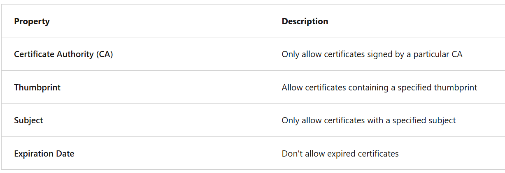

Azure API Management is made up of an

- API gateway
- a management plane
- a developer portal.

_The **API gateway** is the endpoint that -->_

- Work as reverse proxy
- Accepts API calls and routes them to appropriate backends
- Verifies API keys and other credentials presented with requests
- Enforces usage quotas and rate limits
- Transforms requests and responses specified in policy statements
- Caches responses to improve response latency and minimize the load on backend services
- Emits logs, metrics, and traces for monitoring, reporting, and troubleshooting

_The **management plane** is the administrative interface where you set up your API program.
Use it to:_

- Provision and configure API Management service settings
- Define or import API schema
- Package APIs into products
- Set up policies like quotas or transformations on the APIs
- Get insights from analytics
- Manage users

_The **Developer portal** is an automatically generated, fully customizable website with the documentation of your APIs.
Using the developer portal, developers can: -->_

- Read API documentation
- Call an API via the interactive console
- Create an account and subscribe to get API keys
- Access analytics on their own usage
- Download API definitions
- Manage API keys

**Products**

- Products can be open or protected
- Products in API Management have one or more APIs, and are configured with a title, description, and terms of use.

**Groups**

- used to manage the visibility of products to developers.
- API Management has the following _immutable_ system groups:
  1. Administrators
     1. Manage API Management service instances and create the APIs, operations, and products that are used by developers.
     2. Azure subscription administrators are members of this group.
  2. Developers
     1. Authenticated developer portal users that build applications using your APIs.
  3. Guests
     1. Unauthenticated developer portal users.

--> In addition to these system groups, administrators can create custom groups or use external groups in associated Microsoft Entra tenants.

**Developers**

- Developers represent the user accounts in an API Management service instance.

**Policies**

- Policies are a collection of statements that are executed _sequentially_ on the request or response of an API.
- Policy expressions can be used as attribute values or text values in any of the API Management policies, unless the policy specifies otherwise.
- Policies are applied inside the gateway that sits between the API consumer and the managed API.
- The policy definition is a simple XML document that describes a sequence of inbound and outbound statements.
- The configuration is divided into inbound, backend, outbound, and on-error.
- By placing policy statements in the on-error section you can review the error by using the context.LastError property, inspect and customize the error response using the set-body policy, and configure what happens if an error occurs.
- A policy expression is either:

  - a single C# statement enclosed in @(expression) [OR]
  - a multi-statement C# code block, enclosed in @{expression}, that returns a value

- If you have a policy at the global level and a policy configured for an API, then whenever that particular API is used both policies are applied.

- The API Management gateway (also called data plane or runtime) is the service component that's responsible for proxying API requests, applying policies, and collecting telemetry.

- API Management offers both managed and self-hosted gateways:
  1. Managed Gateway
     1. default gateway component that is deployed in Azure for every API Management instance in every service tier.
     2. With the managed gateway, all API traffic flows through Azure regardless of where backends implementing the APIs are hosted.
  2. Self Hosted Gateway
     1. an optional, containerized version of the default managed gateway.
     2. It's useful for hybrid and multicloud scenarios where there's a requirement to run the gateways off of Azure in the same environments where API backends are hosted.
     3. The self-hosted gateway enables customers with hybrid IT infrastructure to manage APIs hosted on-premises and across clouds from a single API Management service in Azure.

Some of the APIM Policies

1. Control Flow
   1. Conditionally applies policy statements based on the results of the evaluation of Boolean expressions.
   2. The choose policy applies enclosed policy statements based on the outcome of evaluation of boolean expressions, similar to an if-then-else or a switch construct in a programming language.
   3. The control flow policy must contain at least one <when/> element.

<choose>
    <when condition="Boolean expression | Boolean constant">
        <!— one or more policy statements to be applied if the above condition is true  -->
    </when>
    <when condition="Boolean expression | Boolean constant">
        <!— one or more policy statements to be applied if the above condition is true  -->
    </when>
    <otherwise>
        <!— one or more policy statements to be applied if none of the above conditions are true  -->
    </otherwise>
</choose>

2. Forward Request
   1. forwards the incoming request to the backend service specified in the request context.
   2. Removing this policy results in the request not being forwarded to the backend service.
3. Limit Concurrency
   1. prevents enclosed policies from executing by more than the specified number of requests at any time.
4. Log to event hubs
   1. policy sends messages in the specified format to an event hub defined by a Logger entity.
5. Mock Response
   1. is used to mock APIs and operations.
   2. It aborts normal pipeline execution and returns a mocked response to the caller.
6. Retry
   1. The retry policy executes its child policies once and then retries their execution until the retry condition becomes false or retry count is exhausted.
7. Return Response
   1. aborts pipeline execution and returns either a default or custom response to the caller.
   2. Default response is 200 OK with no body.

**Api Subscription Key**

- 3 main subscription scopes

  1. All API --> Applies to every API accessible from the gateway
  2. Single Api --> This scope applies to a single imported API and all of its endpoints
  3. Product --> A product is a collection of one or more APIs that you configure in API Management. You can assign APIs to more than one product. Products can have different access rules, usage quotas, and terms of use.

**API Security with Subscription Key**

- Every subscription has two keys, a primary and a secondary. Having two keys makes it easier when you do need to regenerate a key.
- Applications must include a valid key in all HTTP requests when they make calls to API endpoints that are protected by a subscription.
  - The default header name is Ocp-Apim-Subscription-Key, and the default query string is subscription-key.

**API Security with Certificate | TLS Certificate**

- Certificates can be used to provide Transport Layer Security (TLS) mutual authentication between the client and the API gateway.
- With TLS client authentication, the API Management gateway can inspect the certificate contained within the client request and check for properties like:

- There are two common ways to verify a certificate:

1. Check who issued the certificate. If the issuer was a certificate authority that you trust, you can use the certificate. You can configure the trusted certificate authorities in the Azure portal to automate this process.
2. Ensure you trust the source of any self-signed certificates.

- In the Consumption tier, you must explicitly enable the use of client certificates, which you can do on the Custom domains page. [As in for Azure Functions/ Serverless]

- Every client certificate includes a thumbprint [a hash]. The thumbprint ensures that the values in the certificate haven't been altered since the certificate was issued by the certificate authority.
- To verify thumbprint in multiple certs, obtain the certificates from your partners and use the Client certificates page in the Azure portal to upload them to the API Management resource.

# APIM Policy

- Basic Structure
  `<policies>
  <inbound>
    <!-- statements to be applied to the request go here -->
  </inbound>
  <backend>
    <!-- statements to be applied before the request is forwarded to 
         the backend service go here -->
  </backend>
  <outbound>
    <!-- statements to be applied to the response go here -->
  </outbound>
  <on-error>
    <!-- statements to be applied if there is an error condition go here -->
  </on-error>
</policies>`

- Policy Expressions

  - a single C# statement enclosed in @(expression), or
  - a multi-statement C# code block, enclosed in @{expression}, that returns a value

- Each expression has access to the implicitly provided `context` variable and an allowed subset of .NET Framework types.

- Advanced Policies

  1.  Control flow
      1. the `choose` policy applies enclosed policy statements based on the outcome of evaluation of boolean expressions, similar to an if-then-else or a switch construct in a programming language.

`<choose>
    <when condition="Boolean expression | Boolean constant">
        <!— one or more policy statements to be applied if the above condition is true  -->
    </when>
    <when condition="Boolean expression | Boolean constant">
        <!— one or more policy statements to be applied if the above condition is true  -->
    </when>
    <otherwise>
        <!— one or more policy statements to be applied if none of the above conditions are true  -->
</otherwise>
</choose>`

      - The control flow policy must contain at least one `<when/>` element.
      - `<otherwise>` is optional.

2.  Forward Request

- The `forward-request` policy forwards the incoming request to the backend service specified in the request context.
- The backend service URL is specified in the API settings and can be changed using the set backend service policy.
- Removing this policy results in the request not being forwarded to the backend service.

`<forward-request timeout="time in seconds" follow-redirects="true | false"/>`

3. Limit-concurrency

- The `limit-concurrency` policy prevents enclosed policies from executing by more than the specified number of requests at any time.
- When requests exceed that number, new requests fail immediately with a 429 Too Many Requests status code.

`<limit-concurrency key="expression" max-count="number">
        <!— nested policy statements -->
</limit-concurrency>`

4. Log to event hubs

- The log-to-eventhub policy sends messages in the specified format to an event hub defined by a Logger entity.
- As its name implies, the policy is used for saving selected request or response context information for online or offline analysis.

`<log-to-eventhub logger-id="id of the logger entity" partition-id="index of the partition where messages are sent" partition-key="value used for partition assignment">
  Expression returning a string to be logged
</log-to-eventhub>`

5. Mock Response

- The `mock-response`, as the name implies, is used to mock APIs and operations.
- It aborts normal pipeline execution and returns a mocked response to the caller.
- The policy always tries to return responses of highest fidelity.
- It prefers response content examples, whenever available.
- It generates sample responses from schemas, when schemas are provided and examples aren't.
- If examples or schemas aren't found, responses with no content are returned.

`<mock-response status-code="code" content-type="media type"/>`

6. Retry

- The `retry policy` executes its child policies once and then retries their execution until the retry condition becomes false or retry count is exhausted.

`<retry
    condition="boolean expression or literal"
    count="number of retry attempts"
    interval="retry interval in seconds"
    max-interval="maximum retry interval in seconds"
    delta="retry interval delta in seconds"
    first-fast-retry="boolean expression or literal">
        <!-- One or more child policies. No restrictions -->
</retry>`

7. Return Response

- The `return-response` policy aborts pipeline execution and returns either a default or custom response to the caller. Default response is 200 OK with no body.

`<return-response response-variable-name="existing context variable">
  <set-header/>
  <set-body/>
  <set-status/>
</return-response>`

8. - Validate OAuth 2.0 Access Token

`<inbound>

<base/>
    <!-- Validate JWT token -->
    <validate-jwt header-name="Authorization" failed-validation-httpcode="401" failed-validation-error-message="Unauthorized">
        <openid-config url="https://login.microsoftonline.com/{tenant-id}/v2.0/.well-known/openid-configuration" />
        <required-claims>
            <claim name="aud" match="any">
                <value>{api-app-id}</value>
            </claim>
            <claim name="iss" match="any">
                <value>https://sts.windows.net/{tenant-id}/</value>
            </claim>
        </required-claims>
    </validate-jwt>
</inbound>
`

9. Access Limit/ Quota

` <quota calls="100" renewal-period="86400" increment-condition="true" />`

10. Rate Limit

`<rate-limit-by-key calls="100"  renewal-period="60" counter-key="@(context.Subscription.Key)" />`

# APIM Security

- Subscription key scopes

  - All APIs
  - Single API
  - Product

- There are 2 Subscription keys

  - Primary Key
  - Secondary Key

- Request API with Subscription Key

  - use request header ocp-apim-subscription-key
  - use query param, subscription-key

- Consumption tier in API Management is designed to conform with serverless design principles.

- Secure using ceritificates
  - Things to check
    - Ceritificate signed by Authority
    - Thumbprint
    - Subject
    - Expiration Date
- <base/> tag

- In Azure API Management (APIM), the <base/> tag is used inside policies as a placeholder for inherited policies when using policy fragments or overrides.
- It allows you to include the parent or default policy logic at a specific point rather than duplicating it.
  APIM Policies

  - Define how requests/responses are processed
  - Written in XML
  - Can include transformations, rate limiting, authentication, etc.

  Policy Hierarchy

  - Global (All APIs)
  - API-level
  - Operation-level

  <base/> Usage
  - When you override a policy at a lower level, <base/> includes the parent-level policy.
  - Without <base/>, the parent policy is ignored.

| Feature | `<base/>`                                |
| ------- | ---------------------------------------- |
| Purpose | Include parent or inherited policy logic |
| Context | Policy fragments, overrides              |
| Benefit | Avoid duplication, maintain hierarchy    |

- In Azure API Management (APIM), when you define policies at multiple scopes (Global, Product, API, Operation), the policy execution order is determined by the scope hierarchy.

  - To enforce a specific policy evaluation order, you should leverage policy scopes and the <base/> element.
  - Scope Hierarchy | APIM policies are applied in this order
    | Level | Evaluation Order |
    | --------------------- | ----------------------- |
    | **Global (All APIs)** | Evaluated first |
    | **Product** | Evaluated after Global |
    | **API** | Evaluated after Product |
    | **Operation** | Evaluated last |

  - 2️⃣ <base/> Element

    - Use <base/> inside a child scope policy to include the parent scope policy at a specific location.
    - Without <base/>, the parent scope policy is ignored in that part of the pipeline.
    - This allows you to control exact evaluation order.
