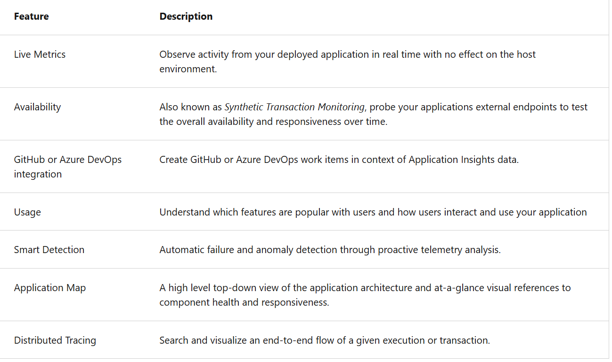
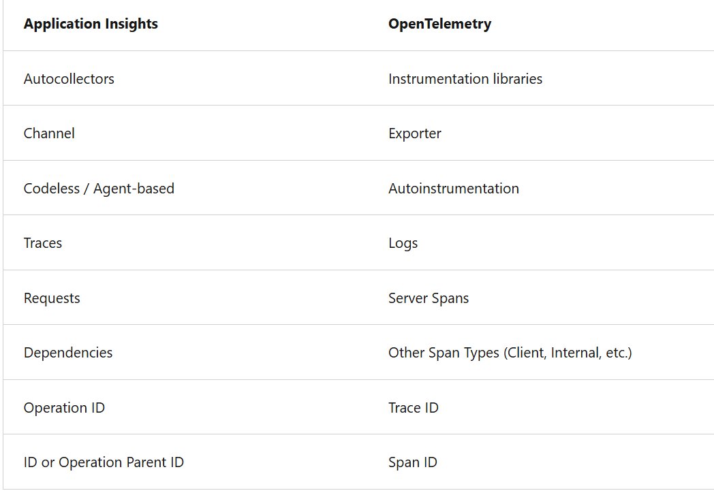

- Application Insights is an extension of Azure Monitor and provides Application Performance Monitoring (APM) features.

- AppInsight Monitors

- Request rates, response times, and failure rates - Find out which pages are most popular, at what times of day, and where your users are. See which pages perform best. If your response times and failure rates go high when there are more requests, then perhaps you have a resourcing problem.
- Dependency rates, response times, and failure rates - Find out whether external services are slowing you down.
- Exceptions - Analyze the aggregated statistics, or pick specific instances and drill into the stack trace and related requests. Both server and browser exceptions are reported.
- Page views and load performance - reported by your users' browsers.
- AJAX calls from web pages - rates, response times, and failure rates.
- User and session counts.
- Performance counters from your Windows or Linux server machines, such as CPU, memory, and network usage.
- Host diagnostics from Docker or Azure.
- Diagnostic trace logs from your app - so that you can correlate trace events with requests.
- Custom events and metrics that you write yourself in the client or server code, to track business events such as items sold or games won.

- In Azure Application Insights, “instrumenting” an application means adding monitoring code or configuration so that the application automatically collects telemetry data.

- free to sign up, and if you choose the basic pricing plan of Application Insights, there's no charge until your application has grown to have substantial usage.

There are several ways to get started monitoring and analyzing app performance:

- At run time: instrument your web app on the server. Ideal for applications already deployed. Avoids any update to the code.
- At development time: add Application Insights to your code. Allows you to customize telemetry collection and send more telemetry.
- Instrument your web pages for page view, AJAX, and other client-side telemetry.
- Analyze mobile app usage by integrating with Visual Studio App Center.
- Availability tests - ping your website regularly from our servers.

- Application Insights log-based metrics let you analyze the health of your monitored apps, create powerful dashboards, and configure alerts.
- There are two kinds of metrics:

1. Log-based metrics behind the scene are translated into Kusto queries from stored events.
   1. Invididual events with lot of properties
2. Standard metrics are stored as preaggregated time series.
   1. standard metrics are preaggregated during collection, they have better performance at query time.
   2. Standard metrics are a better choice for dashboarding and in real-time alerting.
   3. The preaggregated metrics aren't stored as individual events with lots of properties. Instead, they're stored as preaggregated time series, and only with key dimensions.

| Feature       | Standard Metric                   | Log-based Metric                           |
| ------------- | --------------------------------- | ------------------------------------------ |
| Collection    | Automatic                         | Manual / from logs                         |
| Examples      | Requests, Failures, Response Time | Custom counts, aggregates, derived metrics |
| Real-time     | ✅                                | ⚠️ Slight delay                            |
| Customization | ❌                                | ✅                                         |
| Storage       | Optimized metric store            | Log Analytics workspace                    |
| Cost          | Lower                             | Higher (log storage + query)               |

- Use standard metrics for common telemetry & quick alerts
- Use log-based metrics for custom monitoring, business-specific KPIs, or complex queries

- The log-based metrics have more dimensions, which makes them the superior option for data analysis and ad-hoc diagnostics.
- Use the namespace selector to switch between log-based and standard metrics in metrics explorer.

- For situations when the volume of events is too high, Application Insights implements several telemetry volume reduction techniques,
  - such as sampling and filtering that reduces the number of collected and stored events.

2. Preaggregated Metrics [Standard Metrics]
   1. stored as preaggregated time series, and only with key dimensions.
   2. This feature makes the new metrics superior at query time: retrieving data happens faster and requires less compute power.

- At a basic level, "instrumenting" is simply enabling an application to capture telemetry.

- Two methods to instrument your application:

1.  Automatic instrumentation (autoinstrumentation) | telemetry collection through configuration without touching the application's code.
2.  Manual instrumentation | coding against the Application Insights or OpenTelemetry API.

    1.  There are two options for manual instrumentation:

        1. Application Insights SDKs

        - You only need to install the Application Insights SDK in the following circumstances:

                You require custom events and metrics
                You require control over the flow of telemetry
                Auto-Instrumentation isn't available (typically due to language or platform limitations)

        - The app and its components don't have to be hosted in Azure.

          2. Azure Monitor OpenTelemetry Distros.

- After you deploy your web app or website, you can set up recurring tests to monitor availability and responsiveness

  - can create up to 100 availability tests per Application Insights resource.
  - 3 Types of Availability Tests
    - Standard Test
      - checks the availability of a website by sending a single request
      - In addition to validating whether an endpoint is responding and measuring the performance, Standard tests also
        - include TLS/SSL certificate validity,
        - proactive lifetime check,
        - HTTP request verb (for example, GET,HEAD, and POST), c
        - ustom headers,
        - and custom data associated with your HTTP request.
    - Custom Track Availability Test
      - If you decide to create a custom application to run availability tests, you can use the TrackAvailability() method to send the results to Application Insights.
    - URL ping test [Deprecated from 30 Sept 2026]

- Application Map helps you spot performance bottlenecks or failure hotspots across all components of your distributed application. [Important]

  - Each node on the map represents an application component or its dependencies; and has health key performance indicator and alerts status.

  - Components are independently deployable parts of your distributed/microservices application.
    - Components are different from "observed" external dependencies such as SQL, Event Hubs, etc. which your team/organization may not have access to (code or telemetry).
    - Components run on any number of server/role/container instances.
    - Components can be separate Application Insights instrumentation keys (even if subscriptions are different) or different roles reporting to a single Application Insights instrumentation key. The preview map experience shows the components regardless of their configuration.

- The app map finds components by following HTTP dependency calls made between servers with the Application Insights SDK installed.
- If all of the components are roles within a single Application Insights resource, then this discovery step isn't required.

| Feature             | Description                                                                                       |
| ------------------- | ------------------------------------------------------------------------------------------------- |
| **Nodes**           | Each node represents a component or service (e.g., web app, API, database, external dependency).  |
| **Edges**           | Connections between nodes show **requests or dependencies** (e.g., HTTP calls, database queries). |
| **Color coding**    | Nodes and edges are color-coded based on **health, failures, or response time**.                  |
| **Drill-down**      | Clicking a node shows detailed telemetry: requests, failures, response time, dependencies.        |
| **Cross-component** | Supports multi-service, microservices, and hybrid architectures.                                  |

- Application Insights tracks external calls made by your service, including SQL Database queries, REST APIs, and storage operations. Dependency telemetry includes duration, success/failure, and target resource, making it ideal for measuring how long a web service call takes to retrieve data from the database. --> `dependencies`
- `customEvents` capture user-defined actions in the application but do not include database timings.
- `performanceCounters` provide system-level metrics such as CPU or memory usage, and requests represent incoming calls to the web service, not outbound database calls.
