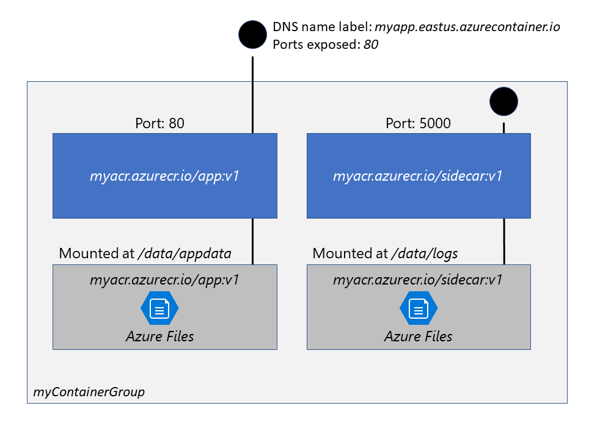
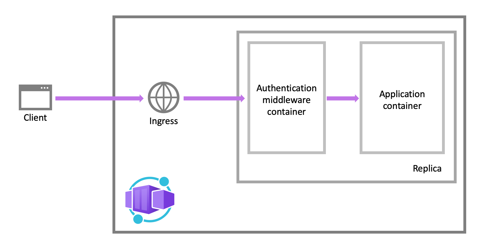
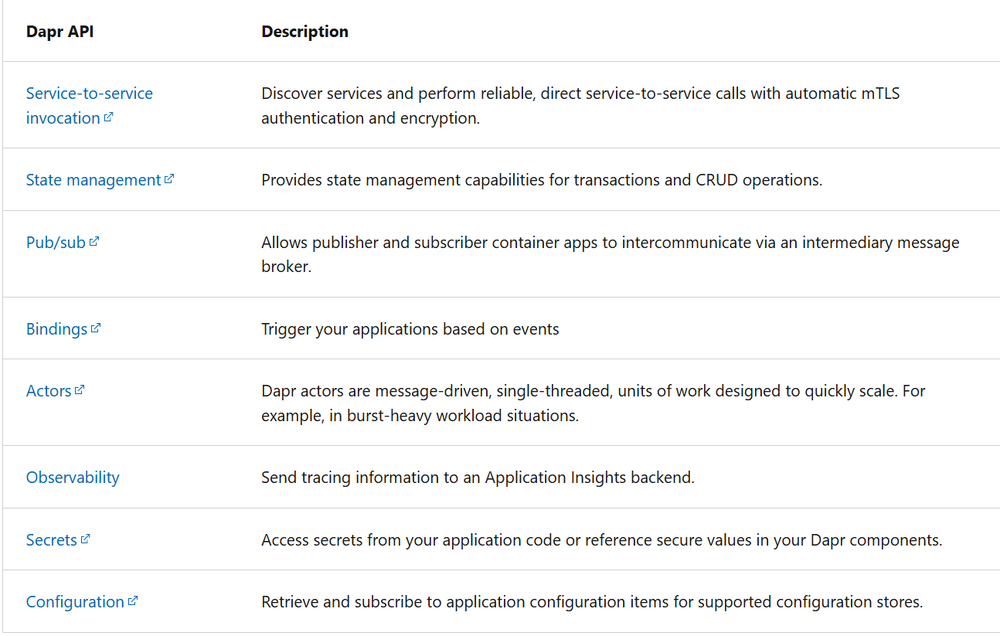
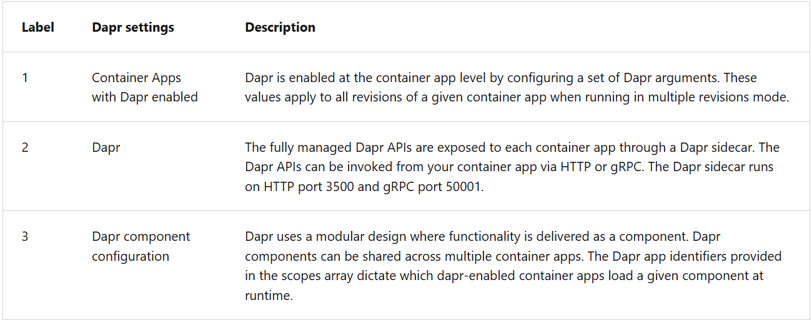

Expected Scope

1. Describe the benefits of Azure Container Instances and how resources are grouped
1. Deploy a container instance in Azure by using the Azure CLI
1. Start and stop containers using policies
1. Set environment variables in your container instances
1. Mount file shares in your container instances
1. Azure Container Apps

- Azure Container Registry (ACR) is a managed registry service based on the open-source Docker Registry 2.0.
- ACR Service Tiers

  1.  Basic
      - A cost-optimized entry point for developers learning about Azure Container Registry.
      - Basic registries have the same programmatic capabilities as Standard and Premium (such as Microsoft Entra authentication integration, image deletion, and webhooks).
      - However, the included storage and image throughput are most appropriate for lower usage scenarios.
  1.  Standard
      - Standard registries offer the same capabilities as Basic, with increased included storage and image throughput.
      - Standard registries should satisfy the needs of most production scenarios.
  1.  Premium
      - Premium registries provide the highest amount of included storage and _concurrent operations, enabling high-volume scenarios._
      - In addition to higher image throughput, Premium adds features such as: _geo-replication for managing a single registry across multiple regions_, _content trust for image tag signing_, and _private link with private endpoints to restrict access to the registry_.

- When images are grouped in a repository, each image is a read-only snapshot of a Docker-compatible container.

- ACR Stores
  - Docker Images
  - Related Content Formats such as Helm Charts, images built to the Open Container Initiative (OCI) Image Format Specification

_Storage Capabilities_

- Encryption-at-Rest

  - All container images and other artifacts in your registry are encrypted at rest.

  - Regional Storage - Azure Container Registry stores data in the region where the registry is created - In all regions except Brazil South and Southeast Asia, Azure might also store registry data in a paired region in the same geography.

  - Geo Replication
  - Zone Redundancy
    - A feature of the Premium service tier, zone redundancy uses Azure availability zones to replicate your registry to a minimum of three separate zones in each enabled region.

_Azure Container Registry Tasks_

- Feature Set
  - Provide cloud-based container image building for platforms like Linux, Windows, and Advanced RISC Machines (Arm).
  - Extend the early parts of an application development cycle to the cloud with on-demand container image builds.
  - Enable automated builds triggered by source code updates, updates to a container's base image, or timers.
- Task Scenarios

  1.  Quick Task
      1.  deploy and push a singale container image to a contianer registry on-demand, in Azure, without needing a local docker installation.
  2.  Automatically triggered task

      1.  Trigger on source code update
      2.  Trigger on base image update
      3.  Trigger on a schedule

  3.  Multi-step task

- Each ACR Task has an associated source code context.
- By default, ACR Tasks builds images for the Linux OS and the amd64 architecture.
- Specify the --platform tag to build Windows images or Linux images for other architectures.
- Specify the OS and optionally a supported architecture in OS/architecture format (for example, --platform Linux/arm).
- For Azure Resource Manager architectures, optionally specify a variant in OS/architecture/variant format (for example, --platform Linux/arm64/v8)

- By default, ACR Tasks builds images for the Linux OS and the amd64 architecture.
  - Specify the `--platform` tag to build Windows images or Linux images for other architectures.

- Docker file typically includes followings

  The base or parent image we use to create the new image
  Commands to update the base OS and install other software
  Build artifacts to include, such as a developed application
  Services to expose, such a storage and network configuration
  Command to run when the container is launched

ACI Benfits [Azure Container Instance]

-- Azure Container Instances (ACI) is a great solution for any scenario that can operate in isolated containers, including simple applications, task automation, and build jobs.

- Fast startup: ACI can start containers in Azure in seconds, without the need to create and manage a virtual machine (VM)
- Container access: ACI enables exposing your container groups directly to the internet with an IP address and a fully qualified domain name (FQDN)
- Hypervisor-level security: Isolate your application as completely as it would be in a VM
- Customer data: The ACI service stores the minimum customer data required to ensure your container groups are running as expected
- Custom sizes: ACI provides optimum utilization by allowing exact specifications of CPU cores and memory
- Persistent storage: Mount Azure Files shares directly to a container to retrieve and persist state
  Linux and Windows: Schedule both Windows and Linux containers using the same API.

_Container Group_

- top level resource in ACI is this.
- is a collection of containers that get scheduled on the same host machine.
- Containers in a container group share a lifecycle, resources, local network, and storage volumes.
- It's similar in concept to a pod in Kubernetes.

-- Multi-container groups currently support only Linux containers. [Important]

- 2 Ways to deploy multi-container group
  - Resource Managemer Template | Recommend when need to deploy more Azure Service Resources when you deploy the container instances.
  - YAML File | Recommended only when deployment included container instance.
- Resource Allocation | by adding the resource requests of the instances in the group.
- Networking |
  - Containers within a group can reach each other via localhost on the ports that they exposed, even if those ports aren't exposed externally on the group's IP address.
- Storage |

  - can specify external volumes to mount within a container group.
  - Supported volumes include:
    - Azure file share
    - Secret
    - Empty directory
    - Cloned git repo

- multi-container groups are useful in cases where you want to divide a single functional task into few container images.

- Container instances are billed by the second, you're charged only for the compute resources used while the container executing your task is running.

- Container Restart Policy

  - When you create a container group in Azure Container Instances, you can specify one of three restart policy settings.
  - 3 policies
    - Always
      - Default
      - Containers in the container group are always restarted.
    - Never
      - Never Restart
      - Run at most once
    - On Failure
      - Containers in the Container group are restarted only when the process executed in the container fails (terminates with non zero exit code)
      - Container run at least once

- Specify the --restart-policy parameter when you call az container create.
  `az container create --resource-group mygrop --name container --image imageName --restart-policy always`

- [!Important] Azure Container Instances starts the container, and then stops it when its application, or script, exits. When Azure Container Instances stops a container whose restart policy is Never or OnFailure, the container's status is set to Terminated.

- set environment variables when create image

`az container create --resource-group myResourceGroup --name mycontainer2 --image mcr.microsoft.com azuredocs/aci-wordcount:latest --restart-policy OnFailure --environment-variables 'NumWords'='5' 'MinLength'='8'`

- To Configure Secure Environment Variable, specify it as a property 'secureValue' insted 'value' in YML
- Deploy container group in YAML [!Important] |
  `az container create --resource-group myResourceGroup  --file fileName.yaml`

- By default, Azure Container Instances are stateless.

- Azure File Share and Container Instance

  - Limitations

    - Can only mount Azure File Share to Linux Containers
    - Azure File Share volume mount requires the Linux containers run as root.
    - Azure File share volume mounts are limited to CIFS support

  - To mount an Azure file share as a volume in a container by using the Azure CLI, specify the share and volume mount point when you create the container with az container create.

    `az container create --resource-group $ACI_PERS_RESOURCE_GROUP --name hellofiles --image mcr.microsoft.com/azuredocs/aci-hellofiles --dns-name-label aci-demo --ports 80 --azure-file-volume-account-name $ACI_PERS_STORAGE_ACCOUNT_NAME --azure-file-volume-account-key $STORAGE_KEY --azure-file-volume-share-name $ACI_PERS_SHARE_NAME --azure-file-volume-mount-path /aci/logs/`

- The _--dns-name-label_ value must be unique within the Azure region where you create the container instance.

- Sample YML

`apiVersion: '2019-12-01'
location: eastus
name: file-share-demo
properties:
containers:

- name: hellofiles
  properties:
  environmentVariables: []
  image: mcr.microsoft.com/azuredocs/aci-hellofiles
  ports: - port: 80
  resources:
  requests:
  cpu: 1.0
  memoryInGB: 1.5
  volumeMounts: - mountPath: /aci/logs/
  name: filesharevolume
  osType: Linux
  restartPolicy: Always
  ipAddress:
  type: Public
  ports: - port: 80
  dnsNameLabel: aci-demo
  volumes:
- name: filesharevolume
  azureFile:
  sharename: acishare
  storageAccountName: <Storage account name>
  storageAccountKey: <Storage account key>
  tags: {}
  type: Microsoft.ContainerInstance/containerGroups`

- To Mount multiple volumes, can use ARM or YAML.

`"volumes": [{
  "name": "myvolume1",
  "azureFile": {
    "shareName": "share1",
    "storageAccountName": "myStorageAccount",
    "storageAccountKey": "<storage-account-key>"
  }
},
{
  "name": "myvolume2",
  "azureFile": {
    "shareName": "share2",
    "storageAccountName": "myStorageAccount",
    "storageAccountKey": "<storage-account-key>"
  }
}]` &&
"volumeMounts": [{
"name": "myvolume1",
"mountPath": "/mnt/share1/"
},
{
"name": "myvolume2",
"mountPath": "/mnt/share2/"
}]

**Azure Container Apps**

[Important]

- Azure Container Apps enables

  - you to run microservices and containerized applications
  - on a serverless platform
  - that runs on top of Azure Kubernetes Service.

- Common uses of Azure Container Apps include:

  - Deploying API endpoints
  - Hosting background processing applications
  - Handling event-driven processing
  - Running microservices

- Applications built on Azure Container Apps can dynamically scale based on:

  - HTTP traffic
  - event-driven processing
  - CPU or memory load
  - any KEDA-supported scaler

- With Azure Container Apps, you can:
  - Run multiple container revisions and manage the container app's application lifecycle.
  - Autoscale your apps based on any KEDA-supported scale trigger. Most applications can scale to zero. (Applications that scale on CPU or memory load can't scale to zero.)
  - Enable HTTPS ingress without having to manage other Azure infrastructure.
  - Split traffic across multiple versions of an application for Blue/Green deployments and A/B testing scenarios.
  - Use internal ingress and service discovery for secure internal-only endpoints with built-in DNS-based service discovery.
  - Build microservices with Dapr and access its rich set of APIs.
  - Run containers from any registry, public or private, including Docker Hub and Azure Container Registry (ACR).
  - Use the Azure CLI extension, Azure portal, or ARM templates to manage your applications.
  - Provide an existing virtual network when creating an environment for your container apps.
  - Securely manage secrets directly in your application.
  - Monitor logs using Azure Log Analytics.

--- HTTP Ingress = A controlled gateway that lets outside users access your internal services over HTTP/HTTPS.

- Individual Containers apps are deployed to a Single Container Apps Environment.

- Container Apps in the same environment are deployed in the same virtual network and write logs to the same Log Analytics workspace.

- Reasons to deploy container apps to the same environment include situations when you need to:

  - Manage related services
  - Deploy different applications to the same virtual network
  - Instrument Dapr applications that communicate via the Dapr service invocation API
  - Have applications to share the same Dapr configuration
  - Have applications share the same log analytics workspace

- Container Apps in the same environment are deployed in the same virtual network and write logs to the same Log Analytics workspace.

  - You might provide an existing virtual network when you create an environment.

- Azure Container Apps supports any Linux-based x86-64 (linux/amd64) container image.
- There's no required base container image, and if a container crashes it automatically restarts. [Important]

# Container Apps Resource Template

`"containers": [
  {
       "name": "main",
       "image": "[parameters('container_image')]",
    "env": [
      {
        "name": "HTTP_PORT",
        "value": "80"
      },
      {
        "name": "SECRET_VAL",
        "secretRef": "mysecret"
      }
    ],
    "resources": {
      "cpu": 0.5,
      "memory": "1Gi"
    },
    "volumeMounts": [
      {
        "mountPath": "/myfiles",
        "volumeName": "azure-files-volume"
      }
    ]
    "probes":[
        {
            "type":"liveness",
            "httpGet":{
            "path":"/health",
            "port":8080,
            "httpHeaders":[
                {
                    "name":"Custom-Header",
                    "value":"liveness probe"
                }]
            },
            "initialDelaySeconds":7,
            "periodSeconds":3
// file is truncated for brevity`

- In a single container app, can add multiple containers to implement the sidecar pattern

- Azure Container Apps manages the details of Kubernetes and container orchestration for you.
- Containers in Azure Container Apps can use any runtime, programming language, or development stack of your choice.
- Azure Container Apps supports any Linux-based x86-64 (linux/amd64) container image. [!Important]
- There's no required base container image, and if a container crashes it automatically restarts. '

[!Important]

- You can define multiple containers in a single container app to implement the sidecar pattern.
- Azure Container Apps has the following limitations:

[Container Apps Limitations]

- Privileged containers: Azure Container Apps can't run privileged containers. If your program attempts to run a process that requires root access, the application inside the container experiences a runtime error.
- Operating system: Linux-based (linux/amd64) container images are required.

- The built-in authentication feature for Container Apps
  - This feature should only be used with HTTPS.
  - Ensure _allowInsecure_ is disabled on your container app's ingress configuration.
  - To restrict app access only to authenticated users, set its Restrict access setting to **Require authentication**.
  - To authenticate but not restrict access, set its Restrict access setting to** Allow unauthenticated access**.

- The authentication and authorization module runs in a separate container, isolated from your application code.

- Authentication Flow

  - Without provider SDK (server-directed flow or server flow): The application delegates federated sign-in to Container Apps. Delegation is typically the case with browser apps, which presents the provider's sign-in page to the user.
  - With provider SDK (client-directed flow or client flow): The application signs users in to the provider manually and then submits the authentication token to Container Apps for validation. This approach is typical for browser-less apps that don't present the provider's sign-in page to the user. An example is a native mobile app that signs users in using the provider's SDK.

#Revision

- A revision is An immutable snapshot of a container app version.
- By default, Container Apps creates a unique revision name with a suffix consisting of a semi-random string of alphanumeric characters.
- New revisions are created when you update your application with revision-scope changes.
- A revision-scope change is any change to the parameters in the properties.template section of the container app resource template.

  These parameters include:

  - Revision suffix
  - Container configuration and images
  - Scale rules for the container application

- Azure Container Apps allows your application to securely store sensitive configuration values.

  - Once secrets are defined at the application level, secured values are available to container apps
  - Secrets are scoped to an application, outside of any specific revision of an application.
  - Adding, removing, or changing secrets doesn't generate new revisions.
  - Each application revision can reference one or more secrets.
  - Multiple revisions can reference the same secrets.

  An updated or deleted secret doesn't automatically affect existing revisions in your app.
  When a secret is updated or deleted, you can respond to changes in one of two ways:

  - Deploy a new revision.
  - Restart an existing revision.

- Before you delete a secret, deploy a new revision that no longer references the old secret. Then deactivate all revisions that reference the secret.

- Container Apps doesn't support Azure Key Vault integration.

  - Instead, enable managed identity in the container app and use the Key Vault SDK in your app to access secrets. [!Important]

- When you create a container app, secrets are defined using the `--secrets` parameter.

  - The parameter accepts a space-delimited set of name/value pairs.
  - Each pair is delimited by an equals sign (=).

- After declaring secrets at the application level, you can reference them in environment variables when you create a new revision in your container app. When an environment variable references a secret, its value is populated with the value defined in the secret. To reference a secret in an environment variable in the Azure CLI, set its value to secretref:, followed by the name of the secret.

`az containerapp create --resource-group "my-resource-group" --name myQueueApp --environment "my-environment-name" --image demos/myQueueApp:v1 --secrets "queue-connection-string=$CONNECTIONSTRING" --env-vars "QueueName=myqueue" "ConnectionString=secretref:queue-connection-string"`

- Azure Container Apps provides three channels through which you can configure Dapr:

  - Container Apps CLI
  - Infrastructure as Code (IaC) templates, as in Bicep or Azure Resource Manager (ARM) templates
  - The Azure portal

- Sidecars
  - Running an additional container alongside your main application container to provide supporting capabilities without changing your app code.

❌ Not supported on Windows App Service
❌ Only for Linux App Service (containers)
❌ Not the same as Kubernetes sidecars
❌ No independent scaling per container

| Feature             | ACI | ACA |
| ------------------- | --- | --- |
| Auto-scale          | ❌  | ✅  |
| Scale to zero       | ❌  | ✅  |
| Rolling deployments | ❌  | ✅  |
| Revisions           | ❌  | ✅  |
| Service discovery   | ❌  | ✅  |
| Dapr                | ❌  | ✅  |
| HTTPS ingress       | ❌  | ✅  |

Choose ACI if:

- You need simple container execution
- No scaling needed
- Short-lived or batch workloads
- You want minimum setup

Choose Azure Container Apps if:

- You’re building APIs or microservices
- You need auto-scaling
- Event-driven workloads (Kafka / Service Bus)
- You want AKS-like power without AKS complexity

ACI = “just run this container”
ACA = “run and scale my containerized application”

# Dapr

- Dapr components in container apps are environment-level resources that:

  - Can provide a pluggable abstraction model for connecting to supporting external services.
  - Can be shared across container apps or scoped to specific container apps.
  - Can use Dapr secrets to securely retrieve configuration metadata.

- By default, all Dapr-enabled container apps within the same environment load the full set of deployed components.
- To ensure components are loaded at runtime by only the appropriate container apps, application scopes should be used.

