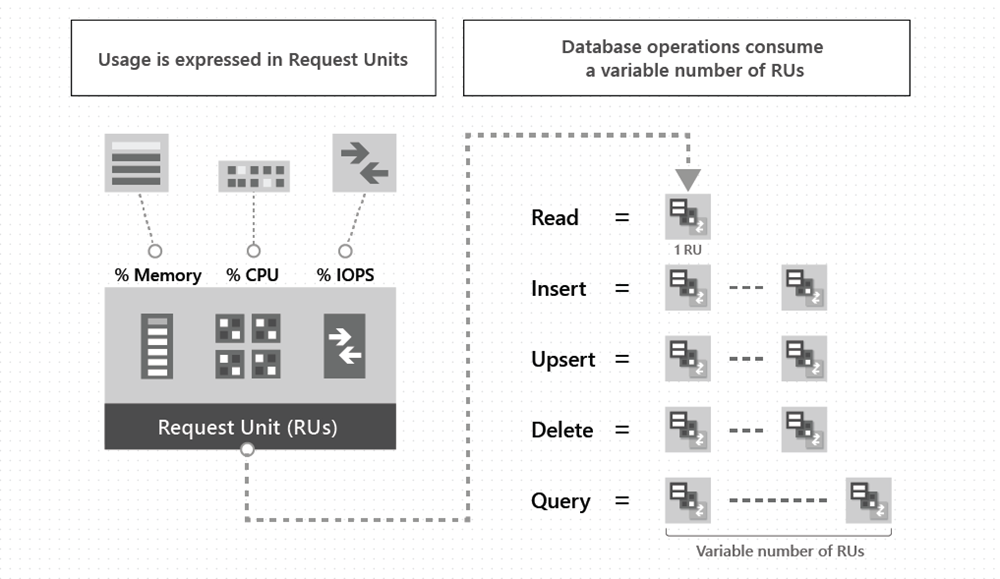
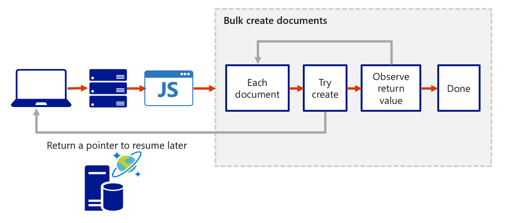

**Azure Cosmos DB**

- multi-master replication protocol
  - enables
    - Unlimited elastic write and read scalability.
    - 99.999% read and write availability all around the world.
    - Guaranteed reads and writes served in less than 10 milliseconds at the 99th percentile.
- offers 99.999% read and write availability for multi-region databases.
- The Azure Cosmos DB account
  - the fundamental unit of global distribution and high availability.
  - contains a unique Domain Name System (DNS) name
  - you can add and remove Azure regions to your account at any time.
- Azure Cosmos DB container
  - the fundamental unit of scalability.
  - You can virtually have an unlimited provisioned throughput (RU/s) and storage on a container.
  - Data is stored on one or more servers called partitions.
  - Partition Key
    - When you create a container, you need to supply a partition key.
    - is a property that you select from your items to help Azure Cosmos DB distribute the data efficiently across partitions.
  - Azure Cosmos DB transparently partitions your container using the logical partition key that you specify in order to elastically scale your provisioned throughput and storage.
- maximum of 50 Azure Cosmos DB accounts under an Azure subscription.

[Important]

- The Usage of Partition Key
  - Az cosmos db use this to route data to the appropriate partition to be written, updated or deleted.
  - can use this key in WHERE clause in queries for faster data retrieval.

**the hierarchy of different entities in an Azure Cosmos DB account**

- The underlying storage mechanism for data in Azure Cosmos DB is called a **physical partition.**
- Physical partitions can have a throughput amount up to 10,000 Request Units per second, and they can store up to 50 GB of data.
- Azure Cosmos DB abstracts this partitioning concept with a logical partition, which can store up to 20 GB of data.
- When data or throughput grows:

  - Cosmos DB splits physical partitions automatically
  - Logical partitions never split

- All items with the same partition key:

  - Go to the same logical partition
  - Are guaranteed to be colocated

- Limits per logical partition

  - Up to 20 GB of data
  - No fixed RU/s limit (shares RU/s of physical partition)

- When you create a container, you configure throughput in one of the following modes:

1. Dedicated throughput: The throughput on a container is exclusively reserved for that container. There are two types of dedicated throughput: standard and autoscale.

2. Shared throughput: Throughput is specified at the database level and then shared with up to 25 containers within the database. Sharing of throughput excludes containers that are configured with their own dedicated throughput.

[Important]

- Azure Cosmos DB, Data Consistency Spectrum
  

- The consistency levels are region-agnostic and are guaranteed for all operations, regardless of:

1. The region where the reads and writes are served
2. The number of regions associated with your Azure Cosmos DB account
3. Whether your account is configured with a single or multiple write regions.

_Read consistency applies to a single read operation scoped within a partition-key range or a logical partition._

- Consistency levels define the guarantees for reads after writes have been acknowledged.
  - Data Consosistency Levels -
    - Strong
    - Bounded Staleness
    - Session
    - Consistent Prefix
    - Eventual Consistency

| Consistency           | Read Guarantee                                      | Write Behavior                                                                  |
| --------------------- | --------------------------------------------------- | ------------------------------------------------------------------------------- |
| **Strong**            | Always returns latest committed write               | Write must complete in primary region → higher latency                          |
| **Bounded Staleness** | Reads may lag by a fixed number of versions or time | Writes still committed immediately; reads may be slightly behind                |
| **Session**           | Read-your-own-writes within the same session        | Writes are immediately visible to the same client session; others may see later |
| **Consistent Prefix** | Reads preserve order of writes                      | Writes are ordered, reads may skip recent writes                                |
| **Eventual**          | Reads eventually reflect latest writes              | Writes are immediately committed; reads may lag arbitrarily                     |

---

| Consistency Level       | Guarantees                        | Latency  | Throughput | When to Use                    |
| ----------------------- | --------------------------------- | -------- | ---------- | ------------------------------ |
| **Strong**              | Linearizable reads (latest write) | Highest  | Lowest     | Financial systems              |
| **Bounded Staleness**   | Reads lag by time or versions     | High     | Medium     | Global apps with strict limits |
| **Session** _(default)_ | Read-your-own-writes              | Low      | High       | User-centric apps              |
| **Consistent Prefix**   | Order preserved, may lag          | Very low | Very high  | Logs, feeds                    |
| **Eventual**            | Eventually consistent             | Lowest   | Highest    | Analytics, metrics             |

- Detailed explanation

1️⃣ Strong Consistency

- What it guarantees

  - Reads always return latest committed write
  - Like single-master SQL

  Trade-offs

  ❌ Higher latency
  ❌ Lower availability across regions

  Example

  💰 Bank account balance
  User transfers $100 → immediate read must show updated balance

📌 Only supported within single region or closely paired regions

2️⃣ Bounded Staleness

- What it guarantees

  - Reads can lag by:
    - Time (e.g. 5 seconds)
    - Versions (e.g. 100 updates)

  Global e-commerce stock

  - Stock count can be 2–3 seconds behind

📌 Strong ordering with predictable lag

3️⃣ Session Consistency (DEFAULT)

- What it guarantees

  - Read-your-own-writes
    - Users always see their own updates

  User updates name → refresh → sees updated name
  Other users may see it later
  📌 Best balance of:

  - Performance
  - Cost
  - UX

4️⃣ Consistent Prefix

- What it guarantees

  - Order of writes is preserved
  - May miss recent writes

  Activity feed
  Post A → Post B → Post C
  You will never see C before A or B

📌 No time/version guarantee

5️⃣ Eventual Consistency

- What it guarantees
  - Data eventually converges
  - No ordering guarantee

Metrics can arrive late or out of order
📌 Highest availability & throughput

_Session consistency is the most widely used consistency level for single-region and globally distributed applications._

- Azure Cosmos DB guarantees that 100 percent of read requests meet the consistency guarantee for the consistency level chosen.

- Writes are replicated to a minimum of three replicas in the local region, with asynchronous replication to all other regions.

- Azure Cosmos DB offers multiple database APIs, which include NoSQL, MongoDB, PostgreSQL, Cassandra, Gremlin, and Table.

**Request Units**

- With Azure Cosmos DB, you pay for the throughput you provision and the storage you consume on an hourly basis. [Important]
- Throughput must be provisioned to ensure that sufficient system resources are available for your Azure Cosmos database always.
- The cost of all database operations is normalized in Azure Cosmos DB and expressed by request units (or RUs, for short).
- A request unit represents the system resources such as CPU, IOPS, and memory that are required to perform the database operations supported by Azure Cosmos DB.

- The type of Azure Cosmos DB account you're using determines the way consumed RUs get charged.
- There are two modes for account creation:

  - Provisioned throughput mode: In this mode, you provision the number of RUs for your application on a per-second basis in increments of 100 RUs per second.
  - Serverless mode: In this mode, you don't have to provision any throughput when creating resources in your Azure Cosmos DB account.

**Azure Cosmos DB Stored Procedures**

- Stored procedures are registered per collection, and can operate on any document or an attachment present in that collection.
- Stored Procedeures are written in Javascript.

`var helloWorldStoredProc = {
id: "helloWorld",
serverScript: function () {
var context = getContext();
var response = context.getResponse();

        response.setBody("Hello, World");
    }

}`

- The context object provides access to all operations that can be performed in Azure Cosmos DB, and access to the request and response objects. [Important]
- When defining a stored procedure in the Azure portal, input parameters are always sent as a string to the stored procedure.

1. Create SP

- Creating an item is an asynchronous operation and depends on the JavaScript callback functions. The callback function has two parameters:

  - one for the error object in case the operation fails
  - another for a return value

- The stored procedure also includes a parameter to set the description as a boolean value. When the parameter is set to true and the description is missing, the stored procedure throws an exception.
- When defining a stored procedure in the Azure portal, input parameters are always sent as a string to the stored procedure.

`var createDocumentStoredProc = {
    id: "createMyDocument",
    body: function createMyDocument(documentToCreate) {
        var context = getContext();
        var collection = context.getCollection();
        var accepted = collection.createDocument(collection.getSelfLink(),
              documentToCreate,
              function (err, documentCreated) {
                  if (err) throw new Error('Error' + err.message);
                  context.getResponse().setBody(documentCreated.id)
              });
        if (!accepted) return;
    }
}`

- All Azure Cosmos DB operations must complete within a limited amount of time. Stored procedures have a limited amount of time to run on the server.
- All collection functions return a Boolean value that represents whether that operation completes or not
- JavaScript functions can implement a continuation-based model to batch or resume execution.

**Javascript Continuation Model**

- The JavaScript continuation model in Azure Cosmos DB is about how server-side JavaScript (stored procedures, triggers, UDFs) handles large data sets and long-running operations within Cosmos DB’s execution limits.
- Applies to:

  - Stored procedures (most common in exams)
  - Triggers (less common)
  - UDFs (read-only, no continuation needed)

  ✔ Continuation model applies to stored procedures
  ✔ Used when operations exceed RU or time limits
  ✔ Client must re-invoke stored procedure
  ❌ Stored procedures cannot span partitions
  ❌ No background execution

🎯 When to use continuation model

    - Bulk inserts
    - Batch updates
    - Data cleanup jobs
    - Migration tasks

**Azure CosmosDB Triggers**

- 2 Types
  - Pre-Trigger
  - Post-Trigger
- [Important] The post-trigger runs as part of the same transaction for the underlying item itself. An exception during the post-trigger execution fails the whole transaction. Anything committed is rolled back and an exception returned.

**Change feed**

- Change feed in Azure Cosmos DB is a persistent record of changes to a container in the order they occur.
- Change feed support in Azure Cosmos DB works by listening to an Azure Cosmos DB container for any changes.
- It then outputs the _sorted_ list of documents that were changed in the order in which they were modified.
- The persisted changes can be processed asynchronously and incrementally, and the output can be distributed across one or more consumers for parallel processing.
- You can't filter the change feed for a specific type of operation.
- Currently change feed doesn't log delete operations.

- Two ways you can read from the change feed, push model or pull model.

**Reading with Push Model**

- two ways you can read from the change feed with a push model:

  - Azure Functions Azure Cosmos DB triggers
  - the change feed processor library.

- The change feed processor is part of the Azure Cosmos DB .NET V3 & Java V4 SDKs.

  - ## There are four main components of implementing the change feed processor:
    - Monitored Container [Source Container]
      - The monitored container has the data from which the change feed is generated.
      - Any inserts and updates to the monitored container are reflected in the change feed of the container.
    - Lease Container
      - The lease container acts as a state storage and coordinates processing the change feed across multiple workers.
      - The lease container can be stored in the same account as the monitored container or in a separate account.
    - The compute instance
      - A compute instance hosts the change feed processor to listen for changes.
      - Depending on the platform, it might be represented by a VM, a kubernetes pod, an Azure App Service instance, an actual physical machine. It has a unique identifier referenced as the instance name throughout this article.
  - The delegate:

    - The delegate is the code that defines what you, the developer, want to do with each batch of changes that the change feed processor reads.

    1. Source container – where data changes occur
    1. Lease container – stores checkpoints & partition ownership
    1. Compute host – Function / Worker / Web App
    1. Processor logic – your code that handles changes

✔ Change Feed is pull-based
✔ Requires lease container
✔ Supports exactly-once processing per partition
❌ Does NOT trigger on deletes (soft deletes only)
❌ Does NOT cross containers

## Implementing Change Feed Processor

- When implementing the change feed processor the point of entry is always the monitored container, from a Container instance you call GetChangeFeedProcessorBuilder:

`/// 

/// Start the Change Feed Processor to listen for changes and process them with the HandleChangesAsync implementation.
/// 

private static async Task<ChangeFeedProcessor> StartChangeFeedProcessorAsync(
CosmosClient cosmosClient,
IConfiguration configuration)
{
string databaseName = configuration["SourceDatabaseName"];
string sourceContainerName = configuration["SourceContainerName"];
string leaseContainerName = configuration["LeasesContainerName"];

    Container leaseContainer = cosmosClient.GetContainer(databaseName, leaseContainerName);
    ChangeFeedProcessor changeFeedProcessor = cosmosClient.GetContainer(databaseName, sourceContainerName)
        .GetChangeFeedProcessorBuilder<ToDoItem>(processorName: "changeFeedSample", onChangesDelegate: HandleChangesAsync)
            .WithInstanceName("consoleHost")
            .WithLeaseContainer(leaseContainer)
            .Build();

    Console.WriteLine("Starting Change Feed Processor...");
    await changeFeedProcessor.StartAsync();
    Console.WriteLine("Change Feed Processor started.");
    return changeFeedProcessor;

}`

- Where the first parameter is a distinct name that describes the goal of this processor and the second parameter is the delegate implementation that handles changes. Following is an example of a delegate:

`/// 

/// The delegate receives batches of changes as they are generated in the change feed and can process them.
/// 

static async Task HandleChangesAsync(
ChangeFeedProcessorContext context,
IReadOnlyCollection<ToDoItem> changes,
CancellationToken cancellationToken)
{
Console.WriteLine($"Started handling changes for lease {context.LeaseToken}...");
    Console.WriteLine($"Change Feed request consumed {context.Headers.RequestCharge} RU.");
// SessionToken if needed to enforce Session consistency on another client instance
Console.WriteLine($"SessionToken ${context.Headers.Session}");

    // We may want to track any operation's Diagnostics that took longer than some threshold
    if (context.Diagnostics.GetClientElapsedTime() > TimeSpan.FromSeconds(1))
    {
        Console.WriteLine($"Change Feed request took longer than expected. Diagnostics:" + context.Diagnostics.ToString());
    }

    foreach (ToDoItem item in changes)
    {
        Console.WriteLine($"Detected operation for item with id {item.id}, created at {item.creationTime}.");
        // Simulate some asynchronous operation
        await Task.Delay(10);
    }

    Console.WriteLine("Finished handling changes.");

}`

- Afterwards, you define the compute instance name or unique identifier with `WithInstanceName`, this should be unique and different in each compute instance you're deploying, and finally, which is the container to maintain the lease state with `WithLeaseContainer`

- The normal life cycle of a host instance is:

  1. Read the change feed.
  2. If there are no changes, sleep for a predefined amount of time (customizable with WithPollInterval in the Builder) and go to #1.
  3. If there are changes, send them to the delegate.
  4. When the delegate finishes processing the changes successfully, update the lease store with the latest processed point in time and go to #1.

-- Use of .NET SDK v3 ==> Microsoft.Azure.Cosmos

1. Create Client

`CosmosClient client = new CosmosClient(endpoint, key);`

2. Create Database

- The CosmosClient.CreateDatabaseAsync method throws an exception if a database with the same name already exists.

`// New instance of Database class referencing the server-side database
Database database1 = await client.CreateDatabaseAsync(
    id: "adventureworks-1"
);`

// Check DB Exist and unless create
`// New instance of Database class referencing the server-side database
Database database2 = await client.CreateDatabaseIfNotExistsAsync(
    id: "adventureworks-2"
);`

3. Read Database by Id

`// Reads a Database resource with the ID property of the Database resource you wish to read.
Database database = this.cosmosClient.GetDatabase(database_id);
DatabaseResponse response = await database.ReadAsync();`

4. Delete Database

`await database.DeleteAsync();`

5. Create a Container

`// Set throughput to the minimum value of 400 RU/s
ContainerResponse simpleContainer = await database.CreateContainerIfNotExistsAsync(
    id: containerId,
    partitionKeyPath: partitionKey,
    throughput: 400);`

6. Get Container by Id

`Container container = database.GetContainer(containerId);
ContainerProperties containerProperties = await container.ReadContainerAsync();`

7. Delete a Container

`await database.GetContainer(containerId).DeleteContainerAsync();`

8. Create Item

`ItemResponse<SalesOrder> response = await container.CreateItemAsync(salesOrder, new PartitionKey(salesOrder.AccountNumber));`

9. Read an Item

`string id = "[id]";
string accountNumber = "[partition-key]";
ItemResponse<SalesOrder> response = await container.ReadItemAsync(id, new PartitionKey(accountNumber));`

10. query an Item

`QueryDefinition query = new QueryDefinition(
"select \* from sales s where s.AccountNumber = @AccountInput ")
.WithParameter("@AccountInput", "Account1");

FeedIterator<SalesOrder> resultSet = container.GetItemQueryIterator<SalesOrder>(
query,
requestOptions: new QueryRequestOptions()
{
PartitionKey = new PartitionKey("Account1"),
MaxItemCount = 1
});`
