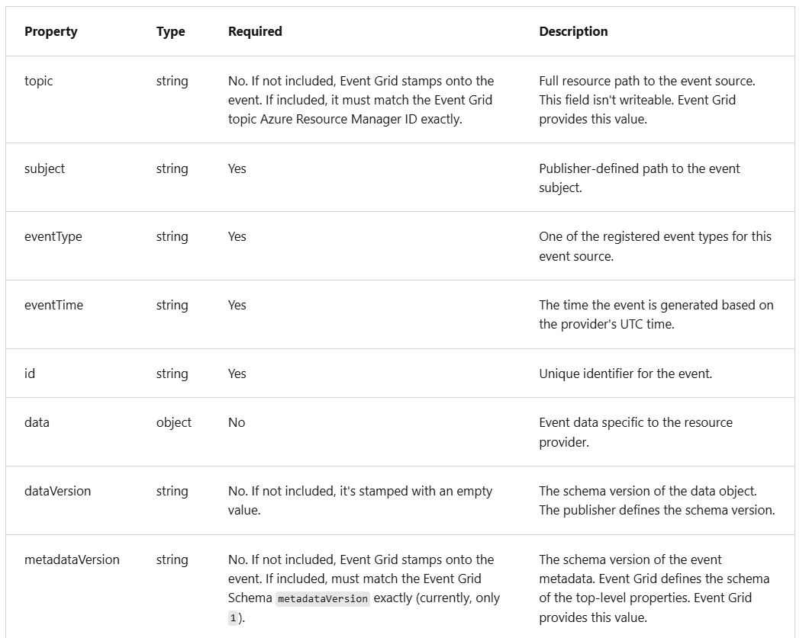
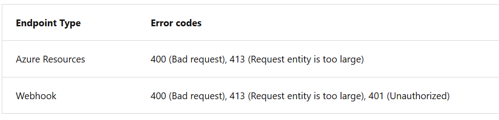
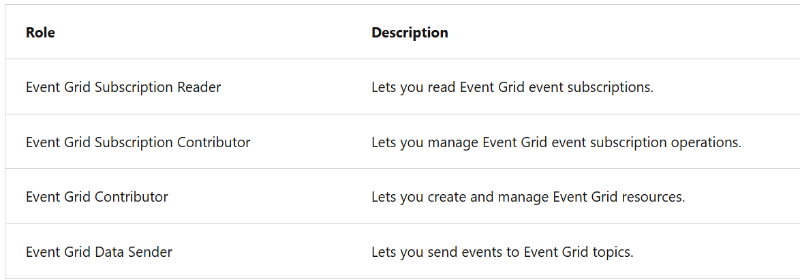
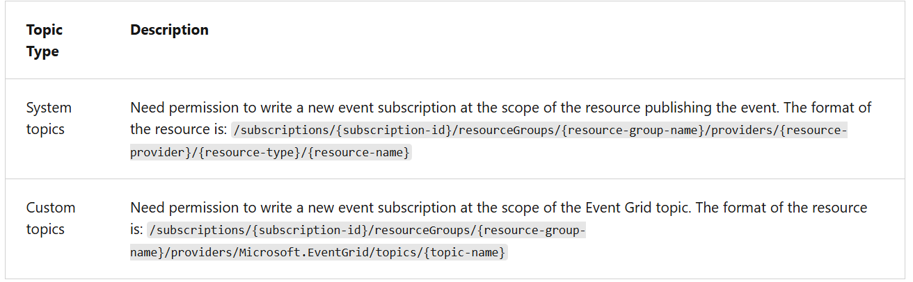
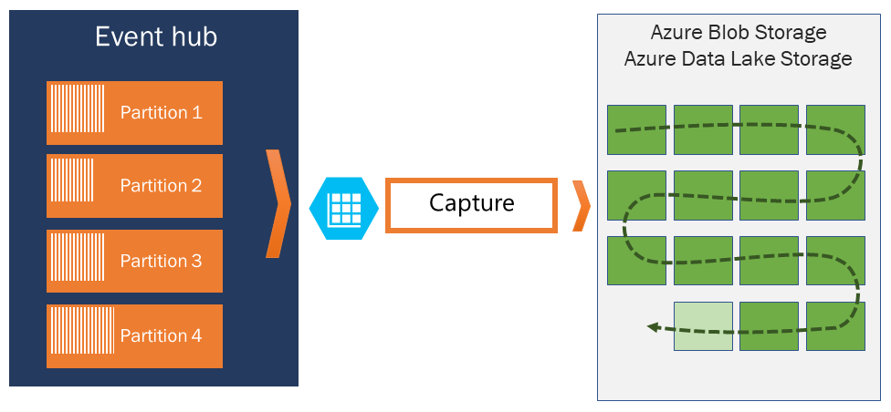

- Azure Event Grid offers flexible message consumption pattern using with the protocols
  - HTTP
  - MQTT [ Message Queuing Telemetry Transport]

- Event Grid enables clients to publish and subscribe to messages over the MQTT v3.1.1 and v5.0 protocols to support Internet of Things (IoT) solutions.

- Event Grid can be configured to send events to subscribers (push delivery)
  or
- subscribers can connect to Event Grid to read events (pull delivery).

- Azure Event Grid Concepts

1. Publisher - application that sends events to Event Grid.
   1. A partner is a kind of publisher that sends events from its system to make them available to Azure customers.
2. Event - the smallest amount of information that fully describes something that happened in a system.
   1. The maximum allowed size for an event is 1 MB. Events over 64 KB are charged in 64-KB increments.
3. Event Source - An event source is where the event happens.
4. Topics - holds events that have been published to Event Grid.
   1. System Topic -
      1. built-in topics provided by Azure services.
      2. You don't see system topics in your Azure subscription because the publisher owns the topics, but you can subscribe to them.
   2. Custom Topic - application and third-party topics.
   3. Partner Topic - kind of topic used to subscribe to events published by a partner.
5. Event Subscription - A subscription tells Event Grid which events on a topic you're interested in receiving.
6. Event Handler -
   1. From an Event Grid perspective, an event handler is the place where the event is sent.
   2. You can use a supported Azure service or your own webhook as the handler.
   3. Depending on the type of handler, Event Grid follows different mechanisms to guarantee the delivery of the event.
      1. ex: For HTTP webhook event handlers, the event is retried until the handler returns a status code of 200 – OK. For Azure Storage Queue, the events are retried until the Queue service successfully processes the message push into the queue.

- If using push delivery, the event handler is an Azure service, and a managed identity is used to authenticate Event Grid, the managed identity should have an appropriate RBAC role. For example, if sending events to Event Hubs, the managed identity used in the event subscription should be a member of the Event Hubs Data Sender role. [IMPORTANT]

- Azure Event Grid supports two types of event schemas:
  - Event Grid event schema
  - Cloud event schema

- Events consist of a set of four required string properties --> id, subject, eventtype, eventtime
- Event sources send events to Azure Event Grid in an array, which can have several event objects. When posting events to an Event Grid topic, the array can have a total size of up to 1 MB.

- You can send multiple events to Event Grid in one request, but there are size limits, and billing is based on size, not just event count.

2️⃣ Size limits

There are two limits:

| Limit type                 | Max size |
| -------------------------- | -------- |
| **Entire array (request)** | **1 MB** |
| **Single event**           | **1 MB** |

❌ If any single event > 1 MB
❌ OR total array > 1 MB
➡️ Event Grid returns HTTP 413 – Payload Too Large

- 3️⃣ Billing is per 64 KB chunk
  - Event Grid charges based on payload size, not just number of events.
  - 1 operation = 64 KB
  - Size is rounded up

- Event Publisher schema
  `[
  {
    "topic": string,
    "subject": string,
    "id": string,
    "eventType": string,
    "eventTime": string,
    "data":{
      object-unique-to-each-publisher
    },
    "dataVersion": string,
    "metadataVersion": string
  }
]`

- Subscribers use the subject to filter and route events. Consider providing the path for where the event happened, so subscribers can filter by segments of that path.

- For CloudEvents schema, that header value is "content-type":_"application/cloudevents+json; charset=utf-8"_.
- For Event Grid schema, that header value is "content-type":_"application/json; charset=utf-8"_. [Important]
- can use CloudEvents for system events, like Blob Storage events and IoT Hub events, and custom events.

- For the following errors Event publishing Retry won't happen
- Event grid doesn't gurantee order of event delivery, so subscribers might recieve out-of-order

To Note - If Dead-Letter isn't configured for an endpoint, events are dropped when the above errors happen. Consider configuring Dead-Letter if you don't want these kinds of events to be dropped.
[Important]

- If the error returned by the subscribed endpoint isn't among the previous list, Event Grid waits 30 seconds for a response after delivering a message. After 30 seconds, if the endpoint fails to respond, the message is queued for retry. Event Grid uses an exponential backoff retry policy for event delivery.

Let's say if the error is 500, then event hub wait for 30s, if after 30s endpoint fails, queued for retry.

- Retry policy
  - Customizations can be done by
    - Maximum number of attempts - The value must be an integer between 1 and 30. The default value is 30.
    - Event time-to-live (TTL) - The value must be an integer between 1 and 1440. The default value is 1440 minutes

- Output Batching | Batch Delivery
  - default is off
  - 1. Max events per batch - Maximum number of events Event Grid delivers per batch.
  - 2. Preferred batch size in kilobytes
    - Target ceiling for batch size in kilobytes.

- Dead Letter Events
  - When Event Grid can't deliver an event within a certain time period or after trying to deliver the event a specific number of times, it can send the undelivered event to a storage account.
  - This process is known as dead-lettering.
  - Event Grid dead-letters an event when one of the following conditions is met.
    - Event isn't delivered within the time-to-live period.
    - The number of tries to deliver the event exceeds the limit.
  - If Event Grid receives a 400 (Bad Request) or 413 (Request Entity Too Large) response code, it immediately schedules the event for dead-lettering.

- There's a five-minute delay between the last attempt to deliver an event and delivery to the dead-letter location. This delay is intended to reduce the number of Blob storage operations.
- If the dead-letter location is unavailable for _four hours_, the event is dropped.

- Custom Delivery Properties
  - can set up to 10 headers when creating an event subscription
  - Each header value shouldn't be greater than 4,096 bytes.
  - can set custom headers on the events that are delivered to the following destinations:

        - Webhooks
        - Azure Service Bus topics and queues
        - Azure Event Hubs
        - Relay Hybrid Connections

  - Before setting the dead-letter location, you must have a storage account with a container. You provide the endpoint for this container when creating the event subscription.

- Event Grid uses Azure role-based access control
- Event Grid provides the following built-in roles:
  - 
  - These roles are focused on event subscriptions and don't grant access for actions such as creating topics.

- Event Grid can deliver events to:
  - WebHook (HTTP endpoint)
  - Event Hub
  - Storage Queue
  - Service Bus Queue / Topic
  - Azure Function

- creating an Event Grid subscription with non-WebHook handlers requires _Microsoft.EventGrid/EventSubscriptions/Write_ permission on the event source.
  - ✅ Scenario 1: WebHook
    - Source: Storage Account
    - Handler: WebHook
    - Required permission: ❌ Not required on source
  - ✅ Scenario 2: Event Hub
    - Source: Storage Account
    - Handler: Event Hub
    - Required permission: ✅ Required on source
  - ✅ Scenario 3: Queue Storage
    - Source: Subscription
    - Handler: Storage Queue
    - Required permission: ✅ Required on source

- The required resource differs based on whether you're subscribing to a system topic or custom topic. Both types are described in this section.

- Webhooks are one of the many ways to receive events from Azure Event Grid.
- When a new event is ready, Event Grid service POSTs an HTTP request to the configured endpoint with the event in the request body.
- When you use any of the following three Azure services, the Azure infrastructure automatically handles this authentication:
  - Azure Logic Apps with Event Grid Connector
  - Azure Automation via webhook
  - Azure Functions with Event Grid Trigger

- If you're using any other type of endpoint, such as an HTTP trigger based Azure function, your endpoint code needs to participate in a validation handshake with Event Grid.
  - Event Grid supports two ways of validating the subscription.
    1. _Synchronous handshake:_
       1. At the time of event subscription creation, Event Grid sends a subscription validation event to your endpoint.
       2. The schema of this event is similar to any other Event Grid event.
       3. The data portion of this event includes a validationCode property.
       4. Your application verifies that the validation request is for an expected event subscription, and returns the validation code in the response synchronously.
       5. This handshake mechanism is supported in all Event Grid versions.
    2. _Asynchronous handshake_:- you can't return the ValidationCode in response synchronously. For example, if you use a third-party service (like Zapier or IFTTT), you can't programmatically respond with the validation code.

- 🔐 Event Grid Manual Validation Handshake
  📌 When it applies
  - API version: 2018-05-01-preview or later
  - Scenario: Creating Event Grid subscriptions via SDK / ARM

- 🧠 How it works (Memory flow: POST → GET → OK)

  1️⃣ Validation event sent
  - Event Grid sends a SubscriptionValidationEvent
  - Event data contains a validationUrl

  2️⃣ Your endpoint must
  - Return HTTP 200 to accept the POST
  - (No validation response required immediately)

  3️⃣ Manual validation
  - You must GET the validationUrl
  - Can use browser or REST client

  4️⃣ Time limit
  - URL valid for 5 minutes
  - Subscription state = AwaitingManualAction

    5️⃣ Success / Failure

    ✅ GET within 5 minutes → Validation succeeds
    ❌ No GET → State becomes Failed
    Subscription must be recreated

- Using self-signed certificates for validation isn't supported. Use a signed certificate from a commercial certificate authority (CA) instead. [IMPORTANT]

- When creating an event subscription, you have three options for filtering:
  - Event types
  - Subject begins with or ends with
  - Advanced fields and operators

- By default, all event types for the event source are sent to the endpoint.

- The JSON syntax for filtering by event type is:
  `"filter": {
  "includedEventTypes": [
    "Microsoft.Resources.ResourceWriteFailure",
    "Microsoft.Resources.ResourceWriteSuccess"
  ]
}`

- The JSON syntax for filtering by subject is:
  `"filter": {
  "subjectBeginsWith": "/blobServices/default/containers/mycontainer/log",
  "subjectEndsWith": ".jpg"
}`

- The JSON syntax for using advanced filters is:
  - In advanced filtering, you specify the: - operator type - The type of comparison. - key - The field in the event data that you're using for filtering. It can be a number, boolean, or string. - value or values - The value or values to compare to the key.
    `"filter": {
  "advancedFilters": [
    {
      "operatorType": "NumberGreaterThanOrEquals",
      "key": "Data.Key1",
      "value": 5
    },
    {
      "operatorType": "StringContains",
      "key": "Subject",
      "values": ["container1", "container2"]
    }
  ]
}`

- The purpose of Cloud Event Schema - To simplify interoperability by providing a common event schema for publishing and consuming cloud-based events.

- Event vs CloudEvent

1️⃣ Event (Event Grid Event schema)

This is Azure’s native / legacy schema.

2️⃣ CloudEvent

This is a CNCF-standard, vendor-neutral schema.

| Feature             | **Event Grid Event**                              | **CloudEvent**                                |
| ------------------- | ------------------------------------------------- | --------------------------------------------- |
| Standard            | Azure-specific                                    | CNCF open standard                            |
| Default in Azure    | ✅ Yes (older/default)                            | ❌ Optional                                   |
| Cross-platform      | ❌ Azure-centric                                  | ✅ Multi-cloud                                |
| Interoperability    | Lower                                             | Higher                                        |
| Required fields     | `id`, `eventType`, `subject`, `data`, `eventTime` | `id`, `type`, `source`, `specversion`, `data` |
| Metadata location   | Envelope                                          | Standardized attributes                       |
| Used in new designs | ⚠️ Legacy                                         | ✅ Recommended                                |

---

Azure Event Hub

- Azure Event Hubs is a big data streaming platform and event ingestion service.
- With Event Hubs, you can ingest, buffer, store, and process your stream in real time to get actionable insights.
- Event Hubs uses a partitioned consumer model.
- Azure Event Hubs enables you to automatically capture the streaming data in Event Hubs in an Azure Blob storage or Azure Data Lake Storage account of your choice, with the added flexibility of specifying a time or size interval.
- Setting up Capture is fast, there are no administrative costs to run it, and it scales automatically with Event Hubs throughput units in the standard tier or processing units in the premium tier.
- 
- Event Hubs Capture enables you to process real-time and batch-based pipelines on the same stream.
- Captured data is written in Apache Avro format.
- Event Hubs Capture enables you to set up a window to control capturing. This window is a minimum size and time configuration with a "first wins policy," meaning that the first trigger encountered causes a capture operation.

- The Storage Naming Convention [The file Name Captured]
  `{Namespace}/{EventHub}/{PartitionId}/{Year}/{Month}/{Day}/{Hour}/{Minute}/{Second}`
  ex: https://mystorageaccount.blob.core.windows.net/mycontainer/mynamespace/myeventhub/0/2017/12/08/03/03/17.avro

- Event Hubs traffic is controlled by throughput units.
- A single throughput unit allows 1 MB per second or 1,000 events per second of ingress and twice that amount of egress.

Scale processing application

- To scale your event processing application, you can run multiple instances of the application and have it balance the load among themselves.

- The key to scale for Event Hubs is the idea of partitioned consumers. In contrast to the competing consumers pattern, the partitioned consumer pattern enables high scale by removing the contention bottleneck and facilitating end to end parallelism.

- Azure Event Hubs supports both Microsoft Entra ID and shared access signatures (SAS) to handle both authentication and authorization.

- Azure built-in roles for authorizing access to Event Hubs data using Microsoft Entra ID and OAuth:
  - Azure Event Hubs Data Owner: Use this role to give complete access to Event Hubs resources.
  - Azure Event Hubs Data Sender: Use this role to give send access to Event Hubs resources.
  - Azure Event Hubs Data Receiver: Use this role to give receiving access to Event Hubs resources.

- To authorize a request to Event Hubs service from a managed identity in your application, you need to configure Azure role-based access control settings for that managed identity.

- A key advantage of using Microsoft Entra ID with Event Hubs is that your credentials no longer need to be stored in your code. Instead, you can request an OAuth 2.0 access token from Microsoft identity platform. Microsoft Entra authenticates the security principal (a user, a group, or service principal) running the application. If authentication succeeds, Microsoft Entra ID returns the access token to the application, and the application can then use the access token to authorize requests to Azure Event Hubs.

- To read (consume) data from Azure Event Hubs, an application must have permissions at the Event Hub (or namespace) level, not at the individual consumer group level.

🔹 Key points explained step by step

1️⃣ Who needs authentication? -
Back-end apps that consume events from Event Hubs

    2️⃣ What permissions are required?
        The client must have one of these rights:

    Listen → read events
    Manage → full control (includes listen)

    Assigned at:
        Event Hubs namespace
        Event hub instance
        Topic (Kafka-compatible)

    3️⃣ How data is consumed
        Data is read using consumer groups
        Each consumer group tracks its own offset

    4️⃣ Important limitation (this is the key idea)

    Even though:
        SAS policies allow some granularity
        ❗ You cannot assign permissions per consumer group

    Permissions apply to:
        All consumer groups under:
        The namespace
        The event hub
        So if an app has Listen access: It can read from any consumer group in that hub.

- Each Event Hubs client (client is created for a publisher) is assigned a unique token that is uploaded to the client. A client that holds a token can only send to one publisher, and no other publisher. If multiple clients share the same token, then each of them shares the publisher.

- Data is consumed from Event Hubs using consumer groups. While SAS policy gives you granular scope, this scope is defined only at the entity level and not at the consumer level. It means that the privileges defined at the namespace level or the event hub instance or topic level are to the consumer groups of that entity.

Event Hubs Client Library [Azure.Messaging.EventHubs]

1. Inspect Event Hubs
   1. To get partition Id --> GetPartitionIdsAsync()

`var connectionString = "<< CONNECTION STRING FOR THE EVENT HUBS NAMESPACE >>";
var eventHubName = "<< NAME OF THE EVENT HUB >>";

await using (var producer = new EventHubProducerClient(connectionString, eventHubName))
{
string[] partitionIds = await producer.GetPartitionIdsAsync();
}`

2. Publish events to event hub
   1. create Producer Client --> EventHubProducerClient()

`var connectionString = "<< CONNECTION STRING FOR THE EVENT HUBS NAMESPACE >>";
var eventHubName = "<< NAME OF THE EVENT HUB >>";

await using (var producer = new EventHubProducerClient(connectionString, eventHubName))
{
using EventDataBatch eventBatch = await producer.CreateBatchAsync();
eventBatch.TryAdd(new EventData(new BinaryData("First")));
eventBatch.TryAdd(new EventData(new BinaryData("Second")));

    await producer.SendAsync(eventBatch);

}`

3. Read events from an event hub
   1. Create Consumer Client
   2. ReadEventsAsync() || given Consumer group

`var connectionString = "<< CONNECTION STRING FOR THE EVENT HUBS NAMESPACE >>";
var eventHubName = "<< NAME OF THE EVENT HUB >>";

string consumerGroup = EventHubConsumerClient.DefaultConsumerGroupName;

await using (var consumer = new EventHubConsumerClient(consumerGroup, connectionString, eventHubName))
{
using var cancellationSource = new CancellationTokenSource();
cancellationSource.CancelAfter(TimeSpan.FromSeconds(45));

    await foreach (PartitionEvent receivedEvent in consumer.ReadEventsAsync(cancellationSource.Token))
    {
        // At this point, the loop will wait for events to be available in the Event Hub. When an event
        // is available, the loop will iterate with the event that was received. Because we did not
        // specify a maximum wait time, the loop will wait forever unless cancellation is requested using
        // the cancellation token.
    }

}`

[Important] It is important to note that this approach to consuming is intended to improve the experience of exploring the Eve

4. Read events from an Event Hubs partition -->
   1. read from a given Partition --> ReadEventsFromPartitionAsync()

5. Process Events using an Event Processor Client
   1. For most production scenarios, the recommendation is to use EventProcessorClient for reading and processing events.
   2. Since the EventProcessorClient has a dependency on Azure Storage blobs for persistence of its state, you need to provide a BlobContainerClient for the processor, which has been configured for the storage account and container that should be used.

`var cancellationSource = new CancellationTokenSource();
cancellationSource.CancelAfter(TimeSpan.FromSeconds(45));

var storageConnectionString = "<< CONNECTION STRING FOR THE STORAGE ACCOUNT >>";
var blobContainerName = "<< NAME OF THE BLOB CONTAINER >>";

var eventHubsConnectionString = "<< CONNECTION STRING FOR THE EVENT HUBS NAMESPACE >>";
var eventHubName = "<< NAME OF THE EVENT HUB >>";
var consumerGroup = "<< NAME OF THE EVENT HUB CONSUMER GROUP >>";

Task processEventHandler(ProcessEventArgs eventArgs) => Task.CompletedTask;
Task processErrorHandler(ProcessErrorEventArgs eventArgs) => Task.CompletedTask;

var storageClient = new BlobContainerClient(storageConnectionString, blobContainerName);
var processor = new EventProcessorClient(storageClient, consumerGroup, eventHubsConnectionString, eventHubName);

processor.ProcessEventAsync += processEventHandler;
processor.ProcessErrorAsync += processErrorHandler;

await processor.StartProcessingAsync();

try
{
// The processor performs its work in the background; block until cancellation
// to allow processing to take place.

    await Task.Delay(Timeout.Infinite, cancellationSource.Token);

}
catch (TaskCanceledException)
{
// This is expected when the delay is canceled.
}

try
{
await processor.StopProcessingAsync();
}
finally
{
// To prevent leaks, the handlers should be removed when processing is complete.

    processor.ProcessEventAsync -= processEventHandler;
    processor.ProcessErrorAsync -= processErrorHandler;

}`

---

Event Hub vs Event Grid

- Event Grid = Reactive notifications
  Ex:
  Storage Account
  ↓
  Event Grid Topic
  ↓
  Azure Function / WebHook

- Event Hubs = High-volume streaming ingestion
  Producers → Event Hub → Consumers (pull using consumer groups)

| Service        | Primary Purpose                  |
| -------------- | -------------------------------- |
| **Event Grid** | Event **routing & notification** |
| **Event Hubs** | Event **streaming & ingestion**  |

🔹 Event Grid

- Push-based
- Discrete events
- “Something happened → react”
- Near real-time routing
- No ordering guarantees

🔹 Event Hubs

- Pull-based
- Continuous stream
- “Large scale telemetry ingestion”
- Ordered per partition
- Replayable events

| Feature       | **Event Grid**           | **Event Hubs**           |
| ------------- | ------------------------ | ------------------------ |
| Event model   | Push                     | Pull                     |
| Throughput    | Low–medium               | Very high (millions/sec) |
| Retention     | ❌ No                    | ✅ Yes (1–90 days)       |
| Replay events | ❌ No                    | ✅ Yes                   |
| Ordering      | ❌ No                    | ✅ Per partition         |
| Fan-out       | Built-in                 | Consumer groups          |
| Filtering     | Advanced (subject, type) | ❌ Minimal               |
| Protocol      | HTTP                     | AMQP / HTTPS             |
| Cost model    | Per event                | Throughput units         |
| Typical size  | Small events             | Large payloads           |

- Authentication Difference
  | Service | Authentication |
  | ---------- | ----------------------------- |
  | Event Grid | Webhook validation + Entra ID |
  | Event Hubs | SAS / Entra ID |

✅ Use Event Grid when:

- Blob created/deleted
- Resource changes
- Trigger Azure Functions
- Event-driven microservices
- Serverless architectures

📌 Example:

When a blob is uploaded → call a function → resize image

✅ Use Event Hubs when:

- Application telemetry
- IoT data ingestion
- Logs & metrics
- Clickstream data
- Kafka-compatible streaming

📌 Example:

Ingest millions of device messages per second

- Event Grid Pub/ Sub
  | Feature | Details |
  | --------- | ------------------------------------------------------------------------------- |
  | Pattern | Push-based, event-driven pub/sub |
  | Ordering | Events **per topic** are delivered in order |
  | Delivery | At least once |
  | Filtering | Supports **subject and event type filters** |
  | Scaling | Millions of events per second |
  | Replay | Supports event replay within the **retention window** (default 24h, can extend) |

### For CloudEvents schema, that header value is "content-type":"application/cloudevents+json; charset=utf-8". For Event Grid schema, that header value is "content-type":"application/json; charset=utf-8"
