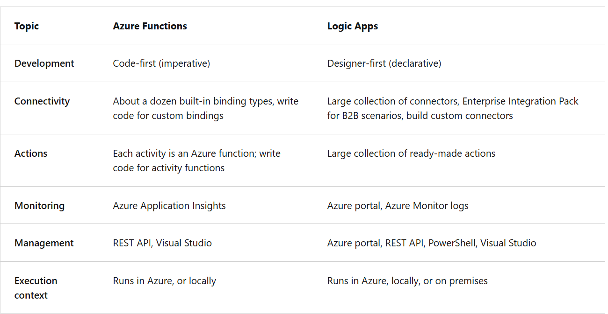
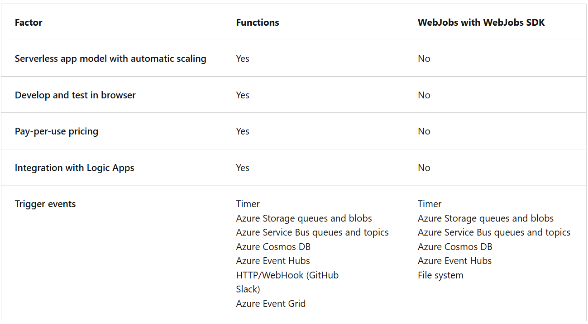
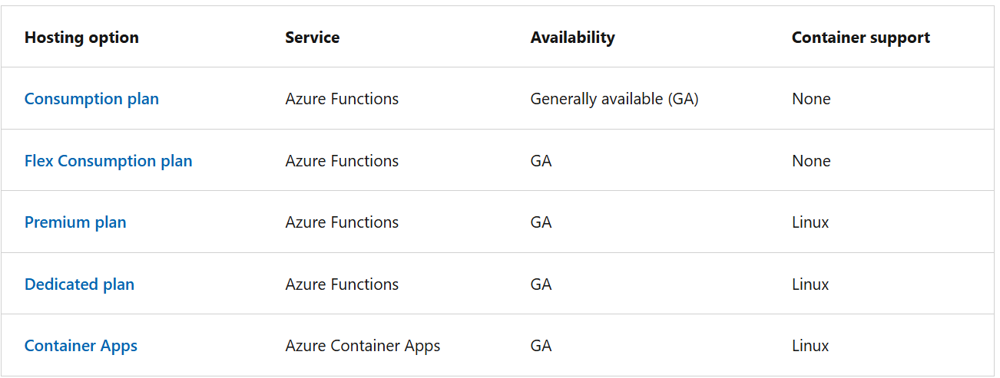
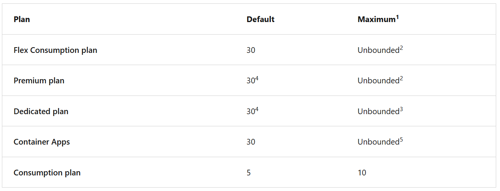
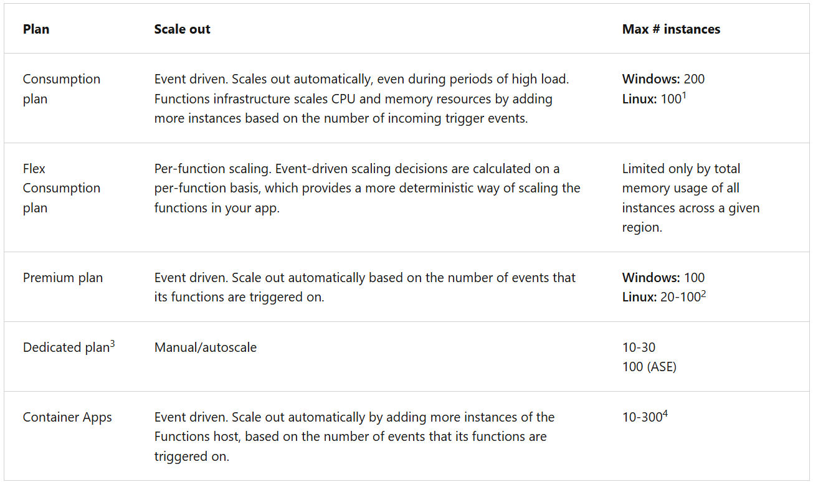
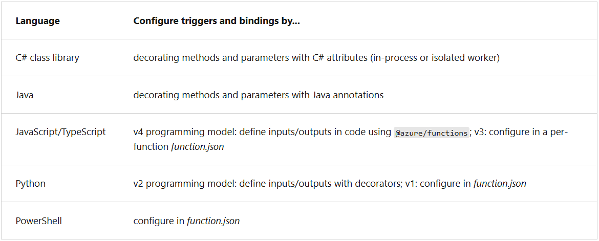

- Serverless Solution
- Two types
  - trigger - ways to start execution of your code
  - bindings - ways to simplify coding for input and output data

[Important]

- Azure Functions is a serverless compute service
- Azure Logic Apps is a serverless workflow integration platform
- Both can create complex orchestrations. An orchestration is a collection of functions or steps, called actions in Logic Apps, that are executed to accomplish a complex task.
- For Azure Functions, you develop orchestrations by writing code and using the Durable Functions extension. For Logic Apps, you create orchestrations by using a GUI or editing configuration files.

- Azure Functions is built on the WebJobs SDK

- Azure Functions Hosting Plan

[Important]

- In the Consumption plan, Azure Functions billing is based on:
  - Number of executions
  - Execution duration × memory (GB-seconds)

This statement means:

- Cost is dominated by execution count, not compute usage
- Each execution is cheap in compute, but too many executions add up

- functionTimeout

  - property in host.json file
  - specifies the time-out duration for functions in a function app.
  - This property applies specifically to function executions.
  - After the trigger starts function execution, the function needs to return/respond within the time-out duration

- Things to note

  - Regardless of the function app time-out setting, _230 seconds_ is the maximum amount of time that an _HTTP triggered function_ can take to respond to a request.
    - This is because of the default idle time-out of Azure Load Balancer.

- Default timeout in mins
  

1. Regardless of the function app time-out setting, 230 seconds is the maximum amount of time that an HTTP triggered function can take to respond to a request. This is because of the default idle time-out of Azure Load Balancer. For longer processing times, consider using the Durable Functions async pattern or defer the actual work and return an immediate response.
2. There's no maximum execution time-out duration enforced. However, the grace period given to a function execution is 60 minutes during scale in for the Flex Consumption and Premium plans, and a grace period of 10 minutes is given during platform updates.
3. Requires the App Service plan be set to Always On. A grace period of 10 minutes is given during platform updates.
4. The default time-out for version 1.x of the Functions host runtime is unbounded.
5. When the minimum number of replicas is set to zero, the default time-out depends on the specific triggers used in the app.

- Function Apps Scaling

1. During scale-out, there's currently a limit of 500 instances per subscription per hour for Linux apps on a Consumption plan.
1. In some regions, Linux apps on a Premium plan can scale to 100 instances.
1. For specific limits for the various App Service plan options, see the App Service plan limits.
1. On Container Apps, you can set the maximum number of replicas, which is honored as long as there's enough cores quota available

- Execution Context | the unit of deployment and management for your functions.
- Trigger & Bindings

  - Every trigger or binding declares whether data flows into the function or out of the function.
  - Binding direction
    - For triggers, the direction is always in
      - Input and output bindings use in and out
      - Some bindings support a special direction inout. If you use inout, only the Advanced editor is available via the Integrate tab in the portal.

- An app running in a Consumption or Elastic Premium plan, uses the _WEBSITE_AZUREFILESCONNECTIONSTRING_ and _WEBSITE_CONTENTSHARE_ settings when connecting to Azure Files on the storage account used by your function app.
- Azure Files _doesn't_ support using managed identity when accessing the file share.

- In some cases, when trying to create a new hosting plan for your function app in an existing resource group you might receive one of the following errors:

      - The pricing tier isn't allowed in this resource group
      - <SKU_name> workers aren't available in resource group <resource_group_name>

- Reason for these is,
  - You create a function app in an existing resource group that has yet to contain another function app or web app. For example, Linux Consumption apps aren't supported in the same resource group as Linux Dedicated or Linux Premium plans.
  - Your new function app is created in the same region as the previous app.
  - The previous app is in some way incompatible with your new app. This incompatibility can occur between versions, operating systems, or is due to other platform-level features, such as availability zone support.

# Durable Functions

- to write stateful functions in a serverless environment.
- define stateful workflows by writing orchestrator functions
- define stateful entities by entity functions
- The primary use case for Durable Functions is simplifying complex, stateful coordination requirements in serverless applications.

Durable Function Patterns

1. Function chaining
2. Fan-out/fan-in
3. Http Trigger Asyn (default in AZ Function Apps)
4. Monitor

- Every Azure Function App must have a Storage Account, even if your functions don’t explicitly use storage.

| Purpose                 | What is stored                      |
| ----------------------- | ----------------------------------- |
| Host runtime state      | Scaling metadata, host locks        |
| Trigger checkpoints     | Queue, EventHub, ServiceBus offsets |
| Durable Functions state | Orchestration history               |
| Deployment packages     | Zip deploy / run-from-package       |
| Function keys & secrets | Encrypted                           |

- Flex Consumption Plan Scaling
  On the Flex Consumption plan, instances of the **Functions host** are dynamically added and removed based on the configured **per instance concurrency** and the number of incoming events.
  - A host instance = one worker VM/container that runs your Function App code. [1 instance = 1 runtime container handling requests]
  - Per instance concurrency - This is how many requests/events a single instance is allowed to process at the same time.
  - Flex does NOT scale based on CPU or memory like App Service.It scales based on request/event pressure

# Exam Trick To Note |

- Consumption Plan will scale based on the resource usage as in instance CPU/ Memory usage. If the usage is High then it will spin up another instance. [Scales based on resource pressure]
- Azure watches CPU / memory
  - When an instance becomes “hot”:
    - New instance is added after a delay
    - Cold starts are common
    - Scaling signal = resource exhaustion
  - In that sense, Consumption Plan is `reactive`
  - Consumption = CPU / memory reactive scaling

| Step                                | What happens |
| ----------------------------------- | ------------ |
| Requests increase                   |              |
| Instance CPU increases              |              |
| Platform detects pressure           |              |
| After delay → new instance is added |              |
| Cold start may occur                |              |

- Flex Consumption Plan will scale based on the number of concurrent event per instance. If this exceeds it will spin up new instance.
  - In that sense, this is `predictive`
  - Flex --> event pressure + concurrency predictive scaling

| Step                                | What happens |
| ----------------------------------- | ------------ |
| Incoming events detected            |              |
| Concurrency limit reached           |              |
| New instances created _immediately_ |              |
| Pre-warmed workers → no cold start  |              |

- Premium plan scales based on incoming events, using pre-warmed instances, but does not scale to zero.

# Flex vs Premium Plan

| Feature             | Premium                    | Flex             |
| ------------------- | -------------------------- | ---------------- |
| Event-based scaling | ✔️                         | ✔️               |
| Cold start          | ❌                         | ❌               |
| Scale to zero       | ❌                         | ✔️               |
| Billing             | Pre-warmed fixed instances | Pure consumption |
| Cost                | High                       | Low              |
| Best for            | Always-on enterprise       | Bursty workloads |

# Important

| Plan        | Scaling Brain                       |
| ----------- | ----------------------------------- |
| Consumption | CPU/memory reactive                 |
| Premium     | Event-driven (warm)                 |
| Flex        | Event-driven (warm + scale-to-zero) |

---

# Development

- A function app provides an execution context in Azure in which your functions run. As such, it's the unit of deployment and management for your functions.
- The `host.json` metadata file contains configuration options that affect all functions in a function app instance.

- Bindings vs Triggers

| Aspect             | Trigger                    | Binding               |
| ------------------ | -------------------------- | --------------------- |
| Purpose            | Starts the function        | Moves data in/out     |
| Count              | Exactly **1 per function** | **Multiple allowed**  |
| Direction          | Always `in`                | `in` or `out` or both |
| Required           | Yes                        | No                    |
| Controls execution | ✅                         | ❌                    |

Ex:

1. Trigger starts function, Binding fetches extra data
   `public static void Run(
    [QueueTrigger("orders")] string orderId,
    [Blob("configs/settings.json", FileAccess.Read)] string config)
{
}`

Bindings helps to connect to other azure resource without explicitly integrating. Ex: when queue trigger run retrive a given blob data also in to the function.

- Data from bindings is provided to the function as parameters.
- Triggers and bindings let you avoid hardcoding access to other services.
- Your function receives data (for example, the content of a queue message) in function parameters.
- You send data (for example, to create a queue message) by using the return value of the function.

- Triggers and bindings are defined differently depending on the development language and runtime model.

**Note**

- `function.json` available only for the Functions written on Javascript/ Typescript, Python, Powershell.

- Since .NET class library functions and Java functions don't rely on `function.json` for binding definitions, they can't be created and edited in the portal.

_function.json_ sample

`{
    "dataType": "binary",
    "type": "httpTrigger",
    "name": "req",
    "direction": "in"
}`

- Other options for dataType are `stream` and `string`.
- For triggers, the direction is always `in`
- Input and output bindings use `in` and `out`
- Some bindings support a special direction `inout`. If you use inout, only the Advanced editor is available via the Integrate tab in the portal.

Sample C# Code

`
using Microsoft.Azure.Functions.Worker;
using Microsoft.Azure.Functions.Worker.Http;

public static class HttpToQueue
{
[Function("HttpToQueue")]
public static MultiResponse Run(
[HttpTrigger(AuthorizationLevel.Function, "get", "post")] HttpRequestData req)
{
var message = "Processed request";
return new MultiResponse
{
Messages = new[] { message },
HttpResponse = req.CreateResponse(System.Net.HttpStatusCode.OK)
};
}
}

public class MultiResponse
{
[QueueOutput("outqueue", Connection = "AzureWebJobsStorage")] // output binding
public string[] Messages { get; set; }
public HttpResponseData HttpResponse { get; set; }
}
`

- Can't configure a binding directly with a connection string or key, instead must use appSetting or Env Variable.

# Important

- Azure Files doesn't support using managed identity when accessing the file share.
- An app running in a `Consumption` or `Elastic Premium plan (Flex Consumption)`, uses the `WEBSITE_AZUREFILESCONNECTIONSTRING` and `WEBSITE_CONTENTSHARE` settings when connecting to Azure Files on the storage account used by your function app.

- When hosted in the Azure Functions service, identity-based connections use a managed identity.
- The system-assigned identity is used by default, although a user-assigned identity can be specified with the `credential` and `clientID` properties.
- Configuring a user-assigned identity with a resource ID is not supported.
