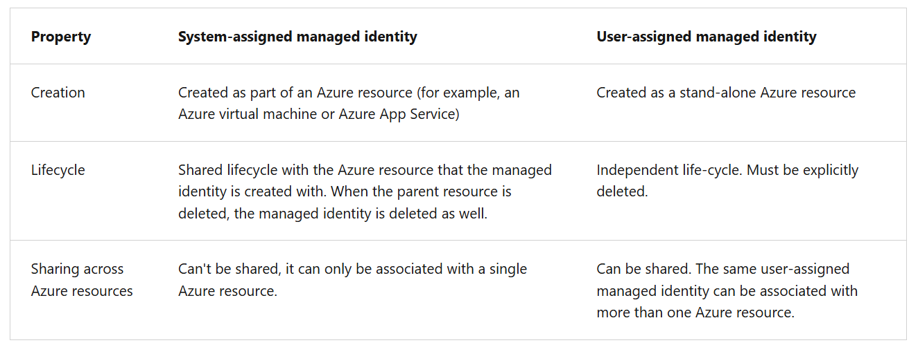

- Azure Key Vault service supports 2 types of containers -
  1. Vault
  2. Managed hardware security module(HSM) pools

- Vaults support storing software and HSM-backed keys, secrets, and certificates.
- Managed HSM pools only support HSM-backed keys.

- Azure Key Vault diagnostic logs and metrics can be configured to:

        * Archive to a storage account.
        * Stream to an event hub.
        * Send the logs to Azure Monitor logs.

- Authentication [3 ways to Authenticate to Key Vault]
  1. Managed Identities for Azure resources [Recommended]
  2. service principal and certificate
  3. service principal and secret

- Azure Key Vault enforces Transport Layer Security (TLS) protocol to protect data when it’s traveling between Azure Key Vault and clients.
- Perfect Forward Secrecy (PFS) protects connections between customers’ client systems and Microsoft cloud services by unique keys.

- Authentication with Key Vault works with Microsoft Entra ID, which is responsible for authenticating the identity of any given security principal.
  A security principal is anything that can request access to Azure resources. This includes:

            - Users – Real people with accounts in Microsoft Entra ID.
            - Groups – Collections of users. Permissions given to the group apply to all its members.
            - Service Principals – Represent apps or services (not people). Think of it like a user account for an app.

- For applications, there are two main ways to obtain a service principal:
  1. Use a managed identity (recommended): Azure creates and manages the service principal for you. The app can securely access other Azure services without storing credentials. Works with services like App Service, Azure Functions, and Virtual Machines.

  2. Register the app manually: You register the app in Microsoft Entra ID. This creates a service principal and an app object that identifies the app across all tenants.

- When an access token isn't supplied, or when the service rejects a token, an HTTP 401 error is returned to the client and includes the WWW-Authenticate header | WWW-Authenticate: Bearer authorization="…", resource="…"
  - authorization: The address of the OAuth2 authorization service that might be used to obtain an access token for the request.
  - resource: The name of the resource (https://vault.azure.net) to use in the authorization request.

- Types of Managed Identities
  - system-assigned managed identity
    - When the identity is enabled, Azure creates an identity for the instance in the Microsoft Entra tenant trusted by the subscription of the instance.
    - Internally, managed identities are service principals of a special type, which are locked to only be used with Azure resources.
  - user assigned managed identity

- common use cases for managed identities:

  _System-assigned managed identity_
  - Workloads contained within a single Azure resource.
  - Workloads needing independent identities.
  - For example, an application that runs on a single virtual machine.

* User-assigned managed identity\*
  - Workloads that run on multiple resources and can share a single identity.
  - Workloads needing preauthorization to a secure resource, as part of a provisioning flow.
  - Workloads where resources are recycled frequently, but permissions should stay consistent.
  - For example, a workload where multiple virtual machines need to access the same resource.

- Managed Identity = Azure creates an identity for the VM, issues tokens via IMDS, and your code uses the token to access Azure services — no secrets. [Ex. VM]

System-Assigned Managed Identity (VM-bound)
📌 Remember as: Enable → Auto-Create → Auto-Delete
Steps (Condensed)

    1️⃣ Enable
        ARM receives request to enable identity on VM

    2️⃣ Create (Auto)
        ARM creates Service Principal in Microsoft Entra ID
        Identity is tied to this VM

    3️⃣ Configure
        ARM updates IMDS with:
            Client ID
            Certificate

    4️⃣ Authorize
        Assign RBAC role to VM identity
        ARM → RBAC role
        Key Vault → Access policy / RBAC

    5️⃣ Token
        VM code calls IMDS endpoint
        169.254.169.254/metadata/identity/oauth2/token

    6️⃣ Use
        Entra ID issues JWT
        Token is sent to Azure service

    🧠 Exam tip:

    Delete VM = identity deleted automatically

    User-Assigned Managed Identity (Reusable)

📌 Remember as: Create → Attach → Reuse
Steps (Condensed)

    1️⃣ Create
        ARM creates User-Assigned Managed Identity
        Service Principal created in Entra ID

    2️⃣ Attach
        ARM attaches identity to VM
        IMDS updated with:
            Client ID
            Certificate

    3️⃣ Authorize (can be before or after attach)
        Assign RBAC roles to identity
        Grant Key Vault access if needed

    4️⃣ Token
        VM code calls IMDS endpoint
        Specifies client_id if multiple identities exist

    5️⃣ Use
        Entra ID returns JWT
        Token used to access Azure service

    🧠 Exam tip:

    Identity survives even if VM is deleted

- You can configure an Azure resource with a managed identity during, or after, the creation of the resource.

- To create, or enable, an Azure virtual machine with the system-assigned managed identity your account needs the Virtual Machine Contributor role assignment. No other Microsoft Entra directory role assignments are required.

- Key Vault SDK is using Azure Identity client library `Azure Identity SDK .NET`

### Keyvault Soft Delete vs Purge

- Purge = permanently delete a Key Vault or secret. it is not the same as Delete.

| Action     | What happens                                  | Can be recovered?               |
| ---------- | --------------------------------------------- | ------------------------------- |
| **Delete** | Vault / secret goes into _soft-deleted_ state | ✔ Yes (within retention period) |
| **Purge**  | Vault / secret is **permanently removed**     | ❌ No (irreversible)            |

✔ When Purge Protection is ON
→ You cannot permanently delete secrets/keys until the soft-delete retention period expires.

✔ When Purge Protection is OFF
→ You can purge deleted secrets/keys at any time during the retention period.

- To create and retrieve a secret, assign your Microsoft Entra user to the `Key Vault Secrets Officer` role.

| Capability                   | Secrets Officer | Secrets Administrator |
| ---------------------------- | --------------- | --------------------- |
| Read secrets                 | ✔               | ✔                     |
| Write secrets                | ✔               | ✔                     |
| Delete secrets (soft delete) | ✔               | ✔                     |
| Recover secrets              | ✔               | ✔                     |
| **Purge secrets**            | ❌              | ✔                     |

- set KeyVault Secret in CLI

`az keyvault secret set --vault-name $keyVaultName  --name "MySecret" --value "My secret value"`

### System-Assigned Managed Identity on a VM

┌─────────────────────────────────────────────┐
│ 1) User / Portal / ARM Template │
│ Request: Enable Managed Identity │
│ on Virtual Machine │
└─────────────────────────────────────────────┘
│
▼
┌─────────────────────────────────────────────┐
│ 2) Azure Resource Manager (ARM) │
│ Creates Service Principal │
│ in Microsoft Entra ID │
│ (Tenant trusted by subscription) │
└─────────────────────────────────────────────┘
│
▼
┌─────────────────────────────────────────────┐
│ 3) ARM Configures the VM │
│ - Updates Instance Metadata Service │
│ (IMDS) endpoint │
│ - Stores Client ID + Certificate │
└─────────────────────────────────────────────┘
│
▼
┌─────────────────────────────────────────────┐
│ 4) Admin Grants Access │
│ - Assign RBAC role for ARM │
│ - Grant Key Vault permissions │
│ (Secrets / Keys) │
└─────────────────────────────────────────────┘
│
▼
┌─────────────────────────────────────────────┐
│ 5) Application Code on VM │
│ Requests Token from IMDS endpoint │
│ http://169.254.169.254/metadata/identity │
│ /oauth2/token │
└─────────────────────────────────────────────┘
│
▼
┌─────────────────────────────────────────────┐
│ 6) IMDS Calls Microsoft Entra ID │
│ - Uses Client ID + Certificate │
│ - Requests Access Token │
└─────────────────────────────────────────────┘
│
▼
┌─────────────────────────────────────────────┐
│ 7) Microsoft Entra ID │
│ Returns JWT Access Token │
└─────────────────────────────────────────────┘
│
▼
┌─────────────────────────────────────────────┐
│ 8) Application Uses Token │
│ Calls Azure Service │
│ (Key Vault / ARM / Storage / SQL etc.) │
└─────────────────────────────────────────────┘

- To assign user-assigned identity to a VM, need the roles for the account
  - Virtual Machine Contributor
  - Managed Identity Operator

- `DefaultAzureCredential` automatically attempts to authenticate via multiple mechanisms, including environment variables or an interactive sign-in.

### The `DefaultAzureCredential` attempts to authenticate via the following mechanisms, **in this order**, stopping when one succeeds:

1. Environment - The DefaultAzureCredential reads account information specified via environment variables and use it to authenticate.
2. Managed Identity - If the application is deployed to an Azure host with Managed Identity enabled, the DefaultAzureCredential authenticates with that account.
3. Visual Studio - If the developer authenticated via Visual Studio, the DefaultAzureCredential authenticates with that account.
4. Azure CLI - If the developer authenticated an account via the Azure CLI az login command, the DefaultAzureCredential authenticates with that account. Visual Studio Code users can authenticate their development environment using the Azure CLI.
5. Azure PowerShell - If the developer authenticated an account via the Azure PowerShell Connect-AzAccount command, the DefaultAzureCredential authenticates with that account.
   Interactive browser - If enabled, the DefaultAzureCredential interactively authenticates the developer via the current system's default browser. By default, this credential type is disabled.

# App Configuration

- AppConfiguration Service Plans
  - Free
  - Developer
  - Standard
  - Premium

- The authentication mode for accessing your app configuration store via Azure Resource Manager.
  - Local
    - With access keys enabled, your App Configuration store can be accessed via Azure Resource Manager.
    - Your App Configuration store cannot be accessed via Azure Resource Manager if access keys are disabled.
    - Proper authorization to access Azure Resource Manager is still required.
  - Pass through
    - This mode is recommended.
    - Microsoft Entra ID will be passed from Azure Resource Manager to App Configuration for authorization.
    - Proper authorization for both Azure App Configuration and Azure Resource Manager are required.

- There are 3 main types of feature flags.

| Feature Type     | Toggle Type           | Scope              | Use Case                             |
| ---------------- | --------------------- | ------------------ | ------------------------------------ |
| **Switch**       | Boolean               | Global             | Kill-switch, simple enable/disable   |
| **Rollout**      | Percentage / Targeted | Subset of users    | Gradual release, canary deployment   |
| **Experimental** | Dynamic / Targeted    | Segment / A/B test | Testing new functionality, analytics |

- Secure Appconfiguration data by using 3 ways
  - cusomter-managed keys
  - private endpoints
  - managed identities

- Azure App Configuration encrypts all data at rest. Enhanced data protection is available via the managed key feature.

1. Enable Customer-managed key capability

#### Prerequisites

- Standard tier Azure App Configuration instance
- Azure Key Vault with soft-delete and purge-protection features enabled
- An RSA or RSA-HSM key within the Key Vault: The key must not be expired, it must be enabled, and it must have both wrap and unwrap capabilities

Once these resources are configured, two steps remain to allow Azure App Configuration to use the Key Vault key:

- Assign a managed identity to the Azure App Configuration instance
- Grant the identity GET, WRAP, and UNWRAP permissions in the target Key Vault's access policy.

- Key Vault Reader → read secrets only
- Key Vault Secrets User → read secrets and use them
- Key Vault Crypto User → wrap/unwrap keys
- Key Vault Contributor → full secret/key access

##### Access Policies = legacy, IAM RBAC = modern. If RBAC enabled, configure Key Vault access via IAM roles.

### Private Endpoints

- Private endpoints for Azure App Configuration to allow clients on a virtual network to securely access data over a private link
- Network traffic between the clients on the virtual network and the App Configuration store traverses over the virtual network using a private link on the Microsoft backbone network, eliminating exposure to the public internet.

##### Pros

- Secure your application configuration details by configuring the firewall to block all connections to App Configuration on the public endpoint.
- Increase security for the virtual network ensuring data doesn't escape.
- Securely connect to the App Configuration store from on-premises networks that connect to the virtual network using VPN or ExpressRoutes with private-peering.

| Security Method                 | What It Is                                                    | How It Works                                                                                                                                    | Key Use Case / Notes                                                          |
| ------------------------------- | ------------------------------------------------------------- | ----------------------------------------------------------------------------------------------------------------------------------------------- | ----------------------------------------------------------------------------- |
| **Customer-Managed Keys (CMK)** | Encrypt App Configuration data at rest with a key you control | You provide an **Azure Key Vault key**; App Configuration uses this key to encrypt stored data instead of Microsoft-managed keys                | Ensures compliance / full control over encryption; rotate keys as needed      |
| **Private Endpoints**           | Restrict network access to App Configuration                  | Creates a **private IP** in your virtual network; all traffic to App Configuration goes through the **VNet**, not public internet               | Protects against public internet exposure; used in highly secure networks     |
| **Managed Identities**          | Identity-based authentication for accessing resources         | App Configuration uses **system- or user-assigned managed identities** to access Key Vault or other Azure resources without storing credentials | Eliminates secrets; enables secure Key Vault references and role-based access |

- CMK → encryption at rest
- Private Endpoint → network isolation
- Managed Identity → identity-based access, no secrets
  Think of it as “Data protection, Network protection, Access protection”

| Symptom          | Root cause                    |
| ---------------- | ----------------------------- |
| Timeout          | Private endpoint / firewall   |
| 401 Unauthorized | Managed identity / RBAC       |
| Key not found    | Wrong label / key             |
| Forbidden        | RBAC or Key Vault permissions |
