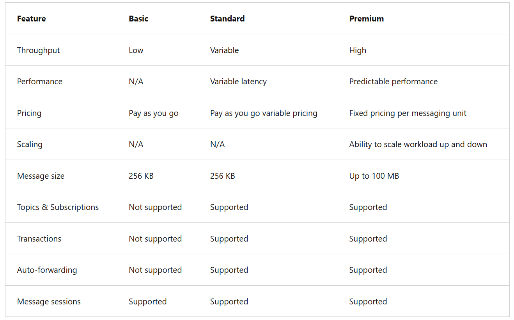
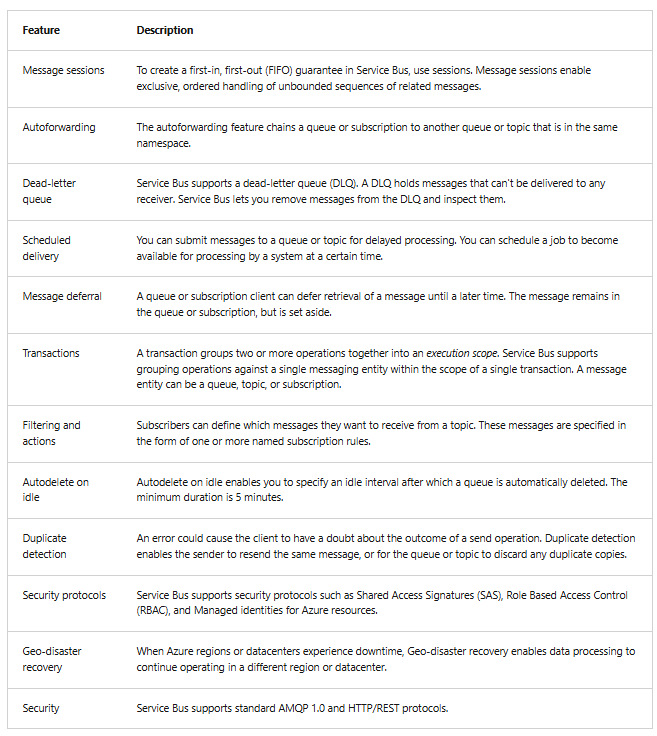
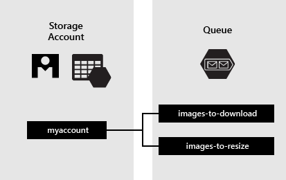

Azure supports two types of queue mechanisms:

- Service Bus queues and Storage queues.

* To consider when using Azure Service Bus Queue

1. Your solution needs to receive messages without having to poll the queue. With Service Bus, you can achieve it by using a long-polling receive operation using the TCP-based protocols that Service Bus supports.
2. Your solution requires the queue to provide a guaranteed first-in-first-out (FIFO) ordered delivery.
3. Your solution needs to support automatic duplicate detection.
4. You want your application to process messages as parallel long-running streams (messages are associated with a stream using the session ID property on the message). In this model, each node in the consuming application competes for streams, as opposed to messages. When a stream is given to a consuming node, the node can examine the state of the application stream state using transactions.
5. Your solution requires transactional behavior and atomicity when sending or receiving multiple messages from a queue.
6. Your application handles messages that can exceed 64 KB but won't likely approach the 256 KB or 1-MB limit, depending on the chosen service tier (although Service Bus queues can handle messages up to 100 MB).
7. You deal with a requirement to provide a role-based access model to the queues, and different rights/permissions for senders and receivers.

- To consider when using Azure Storage Queue

1. Your application must store over 80 gigabytes of messages in a queue.
2. Your application wants to track progress for processing a message in the queue. It's useful if the worker processing a message crashes. Another worker can then use that information to continue from where the prior worker left off.
3. You require server side logs of all of the transactions executed against your queues.

| Feature             | **Azure Queue Storage**    | **Azure Service Bus**                      |
| ------------------- | -------------------------- | ------------------------------------------ |
| Type                | Simple storage-based queue | Enterprise message broker                  |
| Ordering            | ❌ Best-effort             | ✅ Guaranteed (with Sessions)              |
| Delivery guarantee  | At-least-once              | At-least-once / Exactly-once (effectively) |
| Dead-letter queue   | ❌ No                      | ✅ Yes                                     |
| Transactions        | ❌ No                      | ✅ Yes                                     |
| FIFO                | ❌                         | ✅ (Sessions)                              |
| Duplicate detection | ❌                         | ✅                                         |
| Message size        | 64 KB (standard) / 200 KB  | **256 KB (standard) / 100 MB (premium)**   |
| Pub/Sub             | ❌                         | ✅ Topics & Subscriptions                  |
| Scheduling          | ❌                         | ✅                                         |
| Security            | Key/SAS                    | Azure AD, RBAC                             |
| Cost                | **Very cheap**             | More expensive                             |
| Scaling             | Massive                    | Massive but more controlled                |

| If question says…                                | Correct answer        |
| ------------------------------------------------ | --------------------- |
| “Transactional”, “exactly once”, “ordering”      | **Service Bus**       |
| “Pub/sub”, “fan-out”                             | **Service Bus Topic** |
| “Simple queue”, “low cost”, “high volume”        | **Queue Storage**     |
| “Dead-letter”, “sessions”, “duplicate detection” | **Service Bus**       |

- Service Bus Tiers

1. Basic
   1. Suited for simple messaging scenarios with low throughput and minimal feature requirements
   2. The basic tier supports only queues (not topics and subscriptions).
2. Standard
   1. Recommended for developer/test environments or low throughput scenarios where applications aren't sensitive to throttling.
   2. Supports both queues and topics with subscriptions.
3. Premium
   1. Recommended for production scenarios requiring predictable latency and high throughput.
   2. Offers resource isolation at the CPU and memory level and advanced features for mission-critical applications.

- The primary wire protocol for Service Bus is Advanced Messaging Queueing Protocol (AMQP) 1.0, an open ISO/IEC standard.
- Service Bus Premium is fully compliant with the Java/Jakarta EE Java Message Service (JMS) 2.0 API.

- You can specify two different modes in which Service Bus receives messages: Receive and delete or Peek lock.

  - Recieve & Delete | Suitable for application that can tolerate missing messages
  - Peek lock | Suitable for applications that cannot tolerate missing messages

    - In this mode, the receive operation becomes two-stage, which makes it possible to support applications that can't tolerate missing messages.

    Finds the next message to be consumed, locks it to prevent other consumers from receiving it, and then, return the message to the application.

    After the application finishes processing the message, it requests the Service Bus service to complete the second stage of the receive process. Then, the service marks the message as consumed.

    If the application is unable to process the message for some reason, it can request the Service Bus service to abandon the message. Service Bus unlocks the message and makes it available to be received again, either by the same consumer or by another competing consumer. Secondly, there's a timeout associated with the lock. If the application fails to process the message before the lock timeout expires, Service Bus unlocks the message and makes it available to be received again.

| Mode                    | What happens              | Reliability   | Typical use                  |
| ----------------------- | ------------------------- | ------------- | ---------------------------- |
| **Peek-Lock** (default) | Lock → Process → Complete | **Very high** | Business-critical processing |
| **Receive & Delete**    | Read → Delete immediately | Lower         | Fast, best-effort processing |

Peek-Lock:
Queue -> Lock -> Process -> Complete/Delete

Receive & Delete:
Queue -> Read -> DELETE -> Process

- Topic Filter

| Filter                 | What it is                               | Use when                    |
| ---------------------- | ---------------------------------------- | --------------------------- |
| **SQL Filter**         | SQL-like condition on message properties | Most common                 |
| **Boolean Filter**     | Always true / always false               | Enable/disable subscription |
| **Correlation Filter** | Fast equality match on properties        | High-performance routing    |

- SQL Filter = smart routing
- Correlation Filter = fast routing
- Boolean Filter = on/off switch

| If question says…          | Use                |
| -------------------------- | ------------------ |
| “Content-based routing”    | SQL Filter         |
| “High performance routing” | Correlation Filter |
| “Disable subscription”     | Boolean FALSE      |

- Rules & Actions | Without a SQL filter expression, any filter action defined on a subscription is performed on all the messages for that subscription.

- A Service Bus message consists of a binary payload section that Service Bus never handles in any form on the service-side, and two sets of properties.
- The broker properties are system defined. These predefined properties either control message-level functionality inside the broker, or they map to common and standardized metadata items.
- The user properties are a collection of key-value pairs defined and set by the application.

- A subset of the broker properties, specifically

  - To, ReplyTo, ReplyToSessionId, MessageId, CorrelationId, and SessionId, help applications route messages to particular destinations.

# Service Bus, Message Routing Patterns

1. Simple request/reply: A publisher sends a message into a queue and expects a reply from the message consumer.

Client ──Request──▶ Request Queue
Worker ──Reply──▶ Reply Queue
Client ◀──────── Reply Queue

| Feature      | Value             |
| ------------ | ----------------- |
| Reply queues | One per publisher |
| Scalability  | Low–medium        |
| Isolation    | High              |
| Use case     | Simple async RPC  |

2. Multicast request/reply: a publisher sends the message into a topic and multiple subscribers become eligible to consume the message.

Client ──Request──▶ Topic
├── Service A ──Reply──▶ Reply Queue
├── Service B ──Reply──▶ Reply Queue
└── Service C ──Reply──▶ Reply Queue

- Topic fans out the request
- Many consumers reply to same ReplyTo

| Feature     | Value                                  |
| ----------- | -------------------------------------- |
| Fan-out     | Yes                                    |
| Fan-in      | Yes                                    |
| Typical use | Discovery, aggregation, composite APIs |
| Replies     | Multiple                               |

1. Multiplexing (Session): This session feature enables multiplexing of streams of related messages through a single queue or subscription such that each session (or group) of related messages, identified by matching SessionId values, are routed to a specific receiver while the receiver holds the session under lock.

Sessions allow many independent logical message streams to flow through a single queue, with ordering and receiver isolation.

Messages with same SessionId:

- Are grouped
- Delivered in FIFO order
- Locked to a single consumer

Client A ─┐
Client B ─┼─▶ Request Queue ─▶ Worker
Client C ─┘

Worker ──Replies──▶ Shared Reply Queue

Clients filter by CorrelationId

1. Multiplexed request/reply: This session feature enables multiplexed replies, allowing several publishers to share a reply queue. By setting ReplyToSessionId, the publisher can instruct one or more consumers to copy that value into the SessionId property of the reply message.
   1. The publishing queue or topic doesn't need to be session-aware. When the message is sent the publisher can wait for a session with the given SessionId to materialize on the queue by conditionally accepting a session receiver.

- Many publishers share one reply queue, and sessions isolate replies per publisher.

| Problem                     | Solution                  |
| --------------------------- | ------------------------- |
| Too many reply queues       | Single shared reply queue |
| Cross-client message mixing | Session isolation         |
| SaaS-scale RPC              | Yes                       |

- Four official Service bus request/reply messaging pattern

| Pattern         | Queue/Topic | Fan-out | Reply queues   | Sessions | Scalability   |
| --------------- | ----------- | ------- | -------------- | -------- | ------------- |
| Simple          | Queue       | ❌      | One per client | ❌       | Medium        |
| Multicast       | Topic       | ✅      | One per client | ❌       | Medium        |
| Multiplexing    | Queue       | ❌      | N/A            | ✅       | High          |
| Multiplexed R/R | Queue/Topic | ❌      | **One shared** | ✅       | **Very High** |

- Simple → one client, one reply queue
- Multicast → one request, many replies
- Multiplexing → many logical streams, one queue
- Multiplexed R/R → many clients, one reply queue, sessions isolate

- FanOut | One message → many consumers
  Used when

  - Multiple systems must react to the same event
  - You want parallel processing

  Azure services that do this:

  - Service Bus Topics
  - Event Grid

- FanIn | Many responses → one consumer

  Used in:

  - Multicast Request/Reply
  - Price/availability checks
  - Distributed computations

- The legacy SBMP protocol serializes objects with the default binary serializer, or with a serializer that is externally supplied.
- With AMQP, the objects are serialized into an AMQP graph of ArrayList and IDictionary<string,object> objects, and any AMQP client can decode them.

---

**Azure Queue Storage**

- Azure Queue Storage is a service for storing large numbers of messages.
- A queue message can be up to 64 KB in size.
- Queues are commonly used to create a backlog of work to process asynchronously.

- URL format: Queues are addressable using the URL format https://<storage account>.queue.core.windows.net/<queue>
- The queue name must be all lowercase.
- A message, in any format, of up to 64 KB.

- Before version 2017-07-29, the maximum time-to-live allowed is seven days.
- For version 2017-07-29 or later, the maximum time-to-live can be any positive number, or -1 indicating that the message doesn't expire.
- If this parameter is omitted, the default time-to-live is seven days.

- .NET Queue Client

- Libraries use

- Azure.Core library for .NET:
  - This package provides shared primitives, abstractions, and helpers for modern .NET Azure SDK client libraries.
- Azure.Storage.Common client library for .NET:
  - This package provides infrastructure shared by the other Azure Storage client libraries.
- Azure.Storage.Queues client library for .NET:
  - This package enables working with Azure Queue Storage for storing messages that accessed by a client.
- System.Configuration.ConfigurationManager library for .NET:

  - This package provides access to configuration files for client applications.
  - Create queue client | retrieves and manipulates queues stored in Azure Queue Storage.
    - `QueueClient queueClient = new QueueClient(connectionString, queueName);`
  - Create a queue
    - `queueClient.CreateIfNotExists();`
  - Insert Message to Queue
    - ` queueClient.SendMessage(message);`
  - Peek at the next message
    - `queueClient.PeekMessages();`
    - peek at the messages in the queue without removing them from the queue by calling the PeekMessages method.
    - If you don't pass a value for the maxMessages parameter, the default is to peek at one message.
  - Change the contents of a queued message
    - Retrieve First (ReceiveMessages()) --> UpdateMessage() | When you call ReceiveMessages, you get the next message in a queue.
    - `queueClient.ReceiveMessages();` --> ` queueClient.UpdateMessage(message[0].MessageId, message[0].PopReceipt,"Updated contents",TimeSpan.FromSeconds(60.0) // Make it invisible for another 60 seconds);`
  - Dequeue the next message
    - RetriveMessage() --> DeleteMessage()
    - `queueClient.DeleteMessage(retrievedMessage[0].MessageId, retrievedMessage[0].PopReceipt);`
  - Queue Length
    - GetProperties() --> .ApproximateMessageCount [Property] | This number isn't lower than the actual number of messages in the queue, but could be higher.
    - `queueClient.GetProperties()` --> `properties.ApproximateMessagesCount;`
  - Delete Queue
    - Delete()

- RecieveMessages()

  - You get the next message in a queue.
  - A message returned from ReceiveMessages becomes invisible to any other code reading messages from this queue.
  - By default, this message stays invisible for 30 seconds.

- Azure Service Bus Scenarios
  - Message Session
    - Workflow that require message ordering or message deferral
  - Topics and Subscription
  - MEssaging
  - Decouple Application
