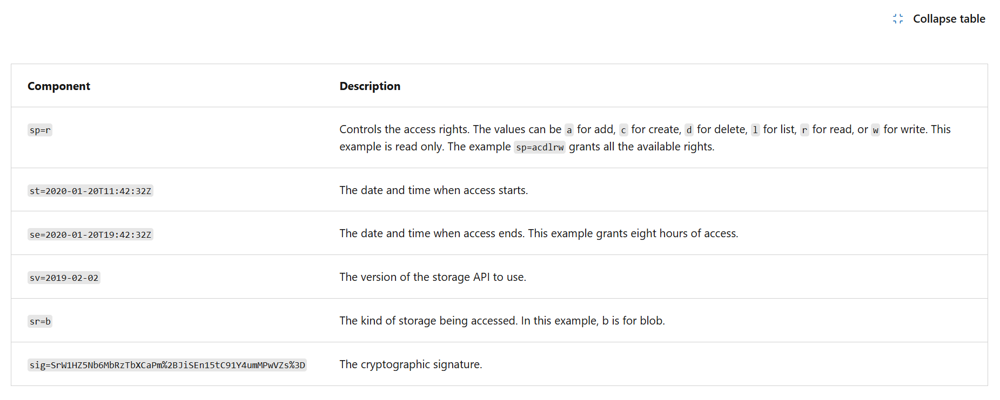
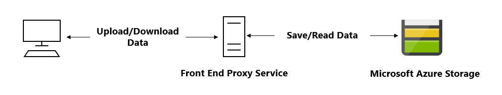
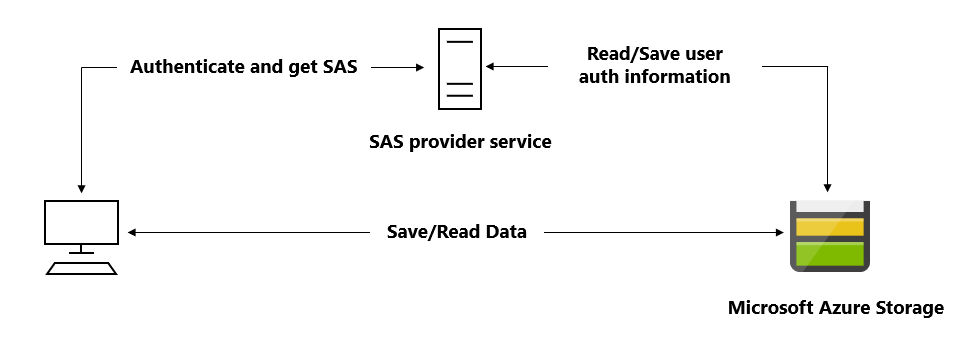

**Microsoft Identity Platform**

- The Microsoft identity platform helps you build applications your users and customers can sign in to using their Microsoft identities or social accounts, and provide authorized access to your own APIs or Microsoft APIs like Microsoft Graph.
-
- Few Components in Microsoft Identity Platform
  1. OAuth 2.0 and OpenID Connect standard-compliant authentication service
     1. enabling developers to authenticate several identity types, including:
     - Work or school accounts, provisioned through Microsoft Entra ID
     - Personal Microsoft account, like Skype, Xbox, and Outlook.com
     - Social or local accounts, by using Azure Active Directory B2C
     - Social or local customer accounts, by using Microsoft Entra External ID

  2. Open-source libraries - Microsoft Authentication Libraries (MSAL) and support for other standards-compliant libraries

  3. Microsoft identity platform endpoint - Works with the Microsoft Authentication Libraries (MSAL) or any other standards-compliant library. It implements human readable scopes, in accordance with industry standards.
  4. Application management portal - A registration and configuration experience in the Azure portal, along with the other Azure management capabilities.
  5. Application configuration API and PowerShell - Programmatic configuration of your applications through the Microsoft Graph API and PowerShell so you can automate your DevOps tasks.

**Service Principal**

- A service principal is an identity used by applications or services, **not humans**, to access Azure resources securely.

- To delegate Identity and Access Management functions to Microsoft Entra ID, an application must be registered with a Microsoft Entra tenant.
- When you register an app in the Azure portal, you choose whether it is:

      1.  Single tenant: only accessible in your tenant
      2. Multi-tenant: accessible in other tenants

[Important]

- If you register an application in the portal, an _application object_ (the globally unique instance of the app) and a service principal object are automatically created in your _home tenant._
- have a globally unique ID for your app (the app or client ID).
- A Microsoft Entra application is scoped to its one and only application object.
- You can also create service principal objects in a tenant using Azure PowerShell, Azure CLI, Microsoft Graph, and other tools.

**Application Object**

- A Microsoft Entra application is scoped to its one and only application object.
- The application object resides in the Microsoft Entra tenant where the application was registered (known as the application's "home" tenant).
- An application object is used as a template or blueprint to create one or more service principal objects.
- A service principal is created in every tenant where the application is used.
- The application object describes three aspects of an application:
  - How the service can issue tokens in order to access the application.
  - Resources that the application might need to access.
  - The actions that the application can take.

- To access reosource protected by MS Entra, the entity which requests the resource should present security principal, either user [user principal] or application [service principal].
  - The security principal defines the access policy and permissions for the user/application in the Microsoft Entra tenant.

- There are 3 type of service principal
  1. Application [Access for Non Home Tenants] - this type of service principal is the local representation, or application instance, of a global application object in a single tenant or directory. - A service principal is created in each tenant where the application is used, and references the globally unique app object. - The service principal object defines what the app can actually do in the specific tenant, who can access the app, and what resources the app can access.

##### Most common for non-Azure or cross-tenant apps

_How it works_

- You register an application in Entra ID
- Azure creates a service principal
- App authenticates using:
  Client secret OR
  Certificate

Used when

- App runs outside Azure
- Multi-tenant SaaS apps
- CI/CD pipelines

2. Managed Identity [Access for Azure Compute Resources, VM, Functions etc.]
   - This type of service principal is used to represent a managed identity.
   - _Managed identities provide an identity for **applications** to use when connecting to resources that support Microsoft Entra authentication._
   - When a managed identity is enabled, a service principal representing that managed identity is created in your tenant.
   - Service principals representing managed identities can be granted access and permissions, but can't be updated or modified directly.

##### Best and safest option inside Azure

_How it works_

- Azure creates & manages the service principal
- App requests tokens via IMDS
- No secrets in code or config

- Types
  - System-assigned (tied to resource)
  - User-assigned (reusable)

1. Legacy [Access from Legacy Apps]

- This type of service principal represents a legacy app, which is an app created before app registrations were introduced or an app created through legacy experiences.
  - A legacy service principal can have:
    - credentials
    - service principal names
    - reply URLs
      and other properties that an authorized user can edit, but doesn't have an associated app registration.

###### Older identity model

- Characteristics
  - Created via older Azure AD APIs
  - Manual secrets
  - Limited capabilities

❌ Not recommended
❌ Avoid in new designs

📌 Appears only in existing/older environments

---

- Application → App identity you manage (client secret/cert)
- Managed Identity → Azure-managed identity (no secrets)
- Legacy → Older Azure AD identities (avoid for new apps)

| Feature                  | **Application**             | **Managed Identity** | **Legacy**             |
| ------------------------ | --------------------------- | -------------------- | ---------------------- |
| Created by               | App registration            | Azure automatically  | Azure AD (old model)   |
| Secret management        | ❌ You manage secrets/certs | ✅ Azure manages     | ❌ Manual              |
| Credential type          | Client secret / certificate | Token via IMDS       | Various legacy methods |
| Runs in Azure            | Optional                    | **Required**         | Optional               |
| Human usable             | ❌ No                       | ❌ No                | ❌ No                  |
| Tenant support           | Single / Multi-tenant       | Single tenant        | Single tenant          |
| Rotation needed          | ✅ Yes                      | ❌ No                | ✅ Yes                 |
| Recommended for new apps | ✅ Yes                      | ✅ **Strongly**      | ❌ No                  |

| Question Clue              | Choose               |
| -------------------------- | -------------------- |
| No secrets, Azure hosted   | **Managed Identity** |
| App runs outside Azure     | **Application**      |
| Multi-tenant access        | **Application**      |
| Old system, existing setup | **Legacy**           |

### Application → You manage secrets

### Managed Identity → Azure manages identity

### Legacy → Don’t use for new apps

![Important]
The application object is the global representation of your application for use across all tenants the service principal is the local representation for use in a specific tenant.

- An application object has:

  A one to one relationship with the software application, and
  A one to many relationships with its corresponding service principal objects.

- Applications that integrate with the Microsoft identity platform follow an authorization model that gives users and administrators control over how data can be accessed.
- OAuth 2.0 is a method through which a third-party app can access web-hosted resources on behalf of a user.
  - Any web-hosted resource that integrates with the Microsoft identity platform has a resource identifier, or application ID URI.
- In OAuth 2.0, permission sets are called scopes. They're also often referred to as permissions.
- In the Microsoft identity platform, a permission is represented as a string value
- An app requests the permissions it needs by specifying the permission in the _scope query parameter_.
- In requests to the authorization, token or consent endpoints for the Microsoft Identity platform, if the resource identifier is omitted in the scope parameter, the resource is assumed to be Microsoft Graph. For example, scope=User.Read is equivalent to https://graph.microsoft.com/User.Read.

- The Microsoft identity platform supports two types of permissions:
  1. delegated access - are used by the apps that have signed-in user present. [with user's prescense]
  2. app-only access permission - are used by apps that run without a signed-in user present [with no user]

- Consent Types [3 types]
  - Static User Content | you must specify all the permissions it needs in the app's configuration in the Azure portal.
    - App requests a fixed set of permissions
    - Permissions are defined at app registration time
    - User is asked to consent once
      App requests:
      - User.Read
      - Mail.Read

    When to use
    - Simple apps
    - Known permission set
    - Internal line-of-business apps

📌 Most common pattern

- Incrrement & Dynamic user consent
  - | You can ask for a minimum set of permissions upfront and request more over time as the customer uses more app features.
  - Incremental, or dynamic consent, only applies to delegated permissions and not to app-only access permissions.

2️⃣ Incremental User Consent

- What it means
  - App requests additional permissions later
  - User is prompted again when new permissions are needed

Day 1 → User.Read
Day 10 → Mail.Read

User consents incrementally.

- When to use

- Apps that grow features over time
- Least-privilege approach

📌 Default behavior for Microsoft identity platform

3️⃣ Dynamic Consent
What it means

- App requests permissions at runtime
- Based on user action or feature usage

User clicks "Import Calendar"
→ App requests Calendar.Read

When to use

    - Feature-based permissions
    - Advanced user-driven scenarios

📌 Requires careful UX design

- Admin Consent

4️⃣ Admin Consent (special case)

What it means

- Tenant administrator grants consent
- Applies to all users in the tenant
- Required for high-privilege permissions

  Example permissions
  - Directory.Read.All
  - User.Read.All
  - Group.ReadWrite.All

When to use

- Enterprise apps
- Daemon apps

Background services

📌 Users are not prompted

| Consent Type | Who Approves | When Prompted | Scope         |
| ------------ | ------------ | ------------- | ------------- |
| Static       | User         | Once          | Fixed         |
| Incremental  | User         | As needed     | Growing       |
| Dynamic      | User         | Runtime       | Feature-based |
| Admin        | Admin        | Once          | Tenant-wide   |

| Consent Type      | Who Grants Consent | Scope                   | Typical Use Case                             | Key Exam Clues                                   |
| ----------------- | ------------------ | ----------------------- | -------------------------------------------- | ------------------------------------------------ |
| **Static**        | User or Admin      | All permissions upfront | Traditional/internal apps                    | “Permissions are known upfront”                  |
| **Incremental**   | User               | Requested as needed     | Modern apps, progressive permission requests | “Permissions requested gradually/as needed”      |
| **Dynamic**       | User               | Runtime / conditional   | Rare / advanced                              | “Permissions requested during execution/runtime” |
| **Admin Consent** | Admin only         | Tenant-wide             | Enterprise apps, high-privilege APIs         | “Tenant-wide approval required”                  |

- Static → all permissions declared at registration, one-time consent
- Incremental → only minimal permissions at first, requests more later
- Dynamic → permissions requested dynamically during runtime
- Admin consent → required for high privilege or enterprise-wide access

- In an OpenID Connect or OAuth 2.0 authorization request, an app can request the permissions it needs by using the scope query parameter.

`GET https://login.microsoftonline.com/common/oauth2/v2.0/authorize?
client_id=00001111-aaaa-2222-bbbb-3333cccc4444
&response_type=code
&redirect_uri=http%3A%2F%2Flocalhost%2Fmyapp%2F
&response_mode=query
**&scope**=
https%3A%2F%2Fgraph.microsoft.com%2Fcalendars.read%20
https%3A%2F%2Fgraph.microsoft.com%2Fmail.send
&state=12345`

---

- Conditional Access
  - The Conditional Access feature in Microsoft Entra ID offers one of several ways that you can use to secure your app and protect a service.
    1. MFA
    2. Allowing only intune enrolled devices to access specific services
    3. Restricting user locations and IP Address

  - Conditional Access doesn't change an app's behavior or require any changes from the developer.
  - But in some scenarios need to change in the code work.
  - Specifically, the following scenarios require code to handle Conditional Access challenges:
    - Apps performing the on-behalf-of flow
    - Apps accessing multiple services/resources
    - Single-page apps using MSAL.js
    - Web apps calling a resource

**MSAL [Microsoft Authentication Library]**

- enables developers to acquire security tokens from the Microsoft identity platform to authenticate users and access secured web APIs.
- (MSAL) defines two types of clients; public clients and confidential clients.
  - public client -
    - run on devices, such as desktop, browserless APIs, mobile or client-side browser apps. They can't be trusted to safely keep application secrets, so they can only access web APIs on behalf of the user.
    - they also only support public client flows and can't hold configuration-time secrets, they can't have client secrets.
  - Confidential client
    - run on servers, such as web apps, web API apps, or service/daemon apps.
    - They're considered difficult to access by users or attackers, and therefore can adequately hold configuration-time secrets to assert proof of its identity.
    - The client ID is exposed through the web browser, but the secret is passed only in the back channel and never directly exposed.

- [A client is a software entity that has a unique identifier assigned by an identity provider. ]
- With MSAL.NET 3.x, the recommended way to instantiate an application is by using the application builders: _PublicClientApplicationBuilder_ and _ConfidentialClientApplicationBuilder_.
- The _identity provider URL (named the instance_) and the _sign-in audience_ for your application. These* two parameters are collectively known as the authority*.

MSAL Library .NET Methods

- Builder Modifiers
  - In the code snippets using application builders, .With methods can be applied as modifiers (for example, `.WithAuthority` and `.WithRedirectUri`
  - WithAuthority
    - sets the application default authority to a Microsoft Entra authority, with the possibility of choosing the Azure Cloud, the audience, the tenant (tenant ID or domain name), or providing directly the authority URI.
  - WithRedirectUri
    - overrides the default redirect URI.
- Modifiers such as .WithCertificate(X509Certificate2 certificate) and .WithClientSecret(string clientSecret) are mutually exclusive. If you provide both, MSAL throws a meaningful exception. ![Applicable only to ConfidentialClientApplicationBuilder ]

**Shared Access Signature**

- A shared access signature (SAS) is a URI that grants restricted access rights to Azure Storage resources.
  - A shared access signature (SAS) is a signed URI that points to one or more storage resources and includes a token that contains a special set of query parameters.

**Types of Shared Access Signature**

1. user Delegation

- A user delegation SAS is secured with Microsoft Entra credentials and also by the permissions specified for the SAS.
- A user delegation SAS applies to _Blob Storage_ and _Data Lake Storage_ only.

2. Service SAS

- A service SAS is secured with the storage account key.
- A service SAS delegates access to a resource in the following Azure Storage services: Blob storage, Queue storage, Table storage, or Azure Files.

3. Account SAS

- An account SAS is secured with the storage account key.
- An account SAS delegates access to resources in one or more of the storage services.
- All of the operations available via a service or user delegation SAS are also available via an account SAS.

Shared Access Singature Components

- 2 Design Patterns to use with AZ Storage

1. 
2. 

**Stored Access Policy**

- A stored access policy provides an extra level of control over service-level shared access signatures (SAS) on the server side.
- can use a stored access policy to change the start time, expiry time, or permissions for a signature, or to revoke it after it is issued.
- storage resources support stored access policies:

  Blob containers
  File shares
  Queues
  Tables

[!Important]

- The access policy for a SAS consists of the start time, expiry time, and permissions for the signature.
- You can specify all of these parameters on the signature URI and none within the stored access policy; all on the stored access policy and none on the URI; or some combination of the two. However, you can't specify a given parameter on both the SAS token and the stored access policy.
  [!Important]

* When you establish a stored access policy on a container, table, queue, or share, it may take up to 30 seconds to take effect.
* During this time requests against a SAS associated with the stored access policy may fail with status code 403 (Forbidden), until the access policy becomes active.
* Table entity range restrictions (startpk, startrk, endpk, and endrk) cannot be specified in a stored access policy.

- Use a SAS when you want to provide secure access to resources in your storage account to any client who doesn't otherwise have permissions to those resources.

[!Important] Additionally, a SAS is required to authorize access to the source object in a copy operation in certain scenarios:

When you copy a blob to another blob that resides in a different storage account, you must use a SAS to authorize access to the source blob. You can optionally use a SAS to authorize access to the destination blob as well.

When you copy a file to another file that resides in a different storage account, you must use a SAS to authorize access to the source file. You can optionally use a SAS to authorize access to the destination file as well.

When you copy a blob to a file, or a file to a blob, you must use a SAS to authorize access to the source object, even if the source and destination objects reside within the same storage account.

**Microsoft Graph**

- Microsoft Graph connectors work in the incoming direction, delivering data external to the Microsoft cloud into Microsoft Graph services and applications, to enhance Microsoft 365 experiences such as Microsoft Search.
- Microsoft Graph Data Connect provides a set of tools to streamline secure and scalable delivery of Microsoft Graph data to popular Azure data stores.

- Microsoft Graph is a RESTful web API that enables you to access Microsoft Cloud service resources.
- The Microsoft Graph API defines most of its resources, methods, and enumerations in the OData namespace, microsoft.graph, in the Microsoft Graph metadata.
- A few API sets are defined in their subnamespaces, such as the call records API which defines resources like callRecord in microsoft.graph.callRecords.

- After you make a request, a response is returned that includes:

1. Status code - An HTTP status code that indicates success or failure.
2. Response message - The data that you requested or the result of the operation. The response message can be empty for some operations.
3. nextLink - If your request returns numerous data, you need to page through it by using the URL returned in @odata.nextLink.

Ex: Graph URL
{HTTP method} https://graph.microsoft.com/{version}/{resource}?{query-parameters}

{HTTP method} - The HTTP method used on the request to Microsoft Graph.
{version} - The version of the Microsoft Graph API your application is using.
{resource} - The resource in Microsoft Graph that you're referencing.
{query-parameters} - Optional OData query options or REST method parameters that customize the response.

- Microsoft Graph currently supports two versions: v1.0 and beta.
- A resource can be an entity or complex type, commonly defined with properties. Entities differ from complex types by always including an id property
- Query parameters can be OData system query options, or other strings that a method accepts to customize its response. [GET https://graph.microsoft.com/v1.0/me/messages?filter=emailAddress eq 'jon@contoso.com']

- The Microsoft Graph SDKs are designed to simplify building high-quality, efficient, and resilient applications that access Microsoft Graph.
- The SDKs include two components:
  - a service library
    - The service library contains models and request builders that are generated from Microsoft Graph metadata to provide a rich and discoverable experience.
  - a core library
    - The core library provides a set of features that enhance working with all the Microsoft Graph services.

- The Microsoft Graph .NET SDK is included in the following NuGet packages:

1. Microsoft.Graph - Contains the models and request builders for accessing the v1.0 endpoint with the fluent API. Microsoft.Graph has a dependency on Microsoft.Graph.Core.
2. Microsoft.Graph.Beta - Contains the models and request builders for accessing the beta endpoint with the fluent API. Microsoft.Graph.Beta has a dependency on Microsoft.Graph.Core.
3. Microsoft.Graph.Core - The core library for making calls to Microsoft Graph.

- To access the data in Microsoft Graph, your application needs to acquire an OAuth 2.0 access token, and presents it to Microsoft Graph in either of the following methods:

The HTTP Authorization request header, as a Bearer token
The graph client constructor, when using a Microsoft Graph client library

- Evolvable enumerations: Evolvable enums are a mechanism that Microsoft Graph API uses to add new members to existing enumerations without causing a breaking change for applications.

- OAuth 2.0 is a method through which a third-party app can access web-hosted resources on behalf of a user.

- The implicit grant allows an application to request a token directly from the authorization endpoint. 
  - It is only recommended for browser-based single-page applications (SPAs).​

#### App Registration Steps (Portal)

1. Microsoft Entra ID → App registrations → New registration
   Fill:
   Name
   Supported account types
   Redirect URI (optional)
2. Configure Authentication (web, SPA, public client)
3. Configure API permissions (Delegated / Application)
4. Add Credentials (client secret / certificate)
5. Assign RBAC to resources for data-plane access

Memory hook:
App Registration → App Object + Service Principal → Configure Auth + Permissions → RBAC

### In Microsoft Entra ID / Azure AD, you don’t explicitly “set” a consent type like incremental or dynamic in a dropdown — it’s determined by how your app requests permissions and how consent is granted.
