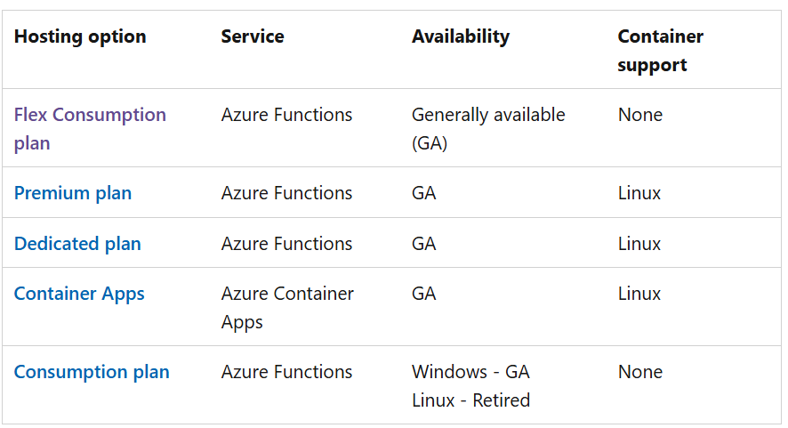
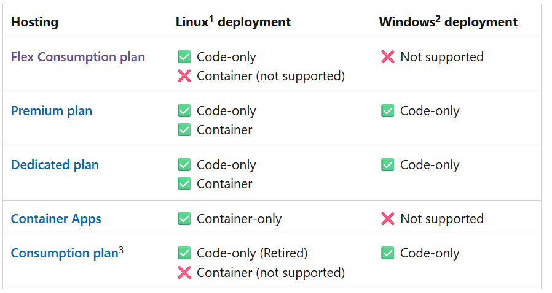
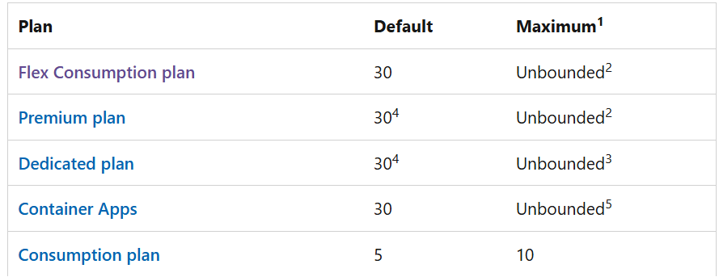
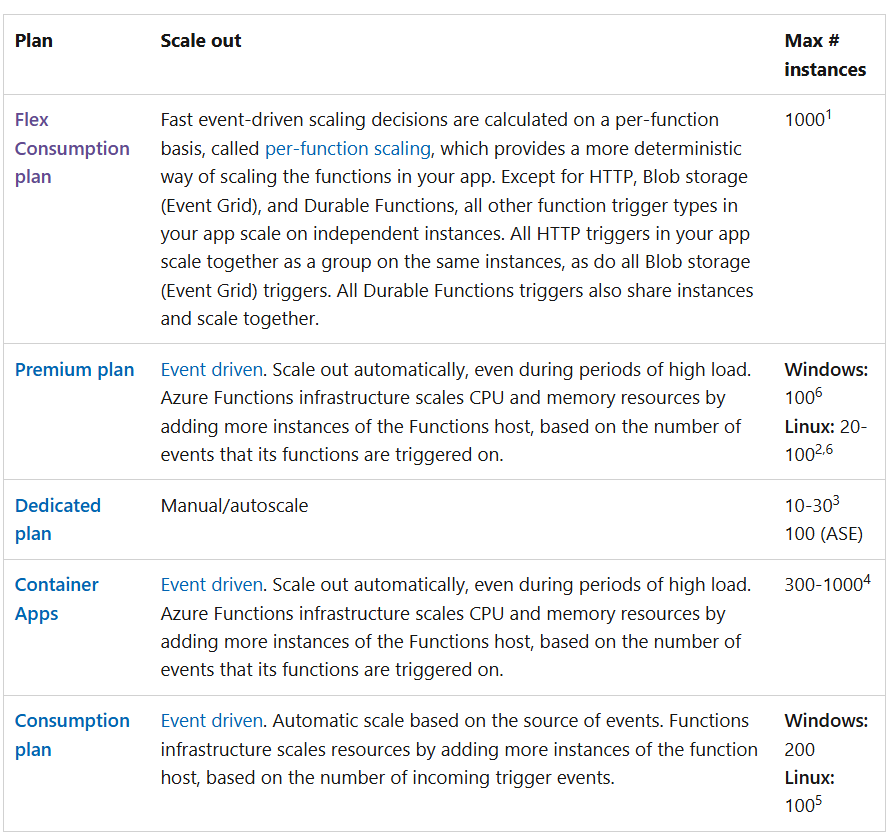
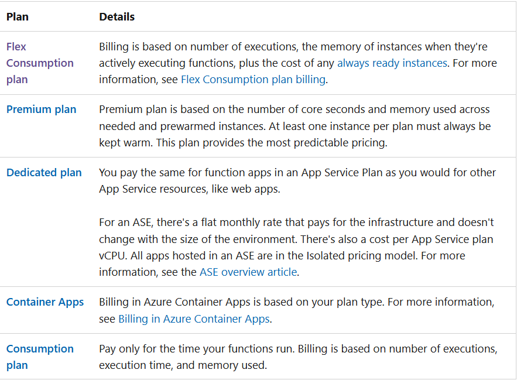

# Function Apps

1. Flex Consumption PLan

Experience fast horizontal scaling, with flexible compute options, virtual network integration, and serverless pay-as-you-go billing.

In the Flex Consumption plan, function instances dynamically scale out (up to 1,000) based on configured per-instance concurrency, incoming events, and per-function workloads for optimal efficiency.

Consider the Flex Consumption plan when:

✔ You need a serverless host for your function code, paying only for on-demand executions.
✔ You require virtual network connectivity for secure access to Azure resources.
✔ Your workloads are variable and can go from no activity to demanding rapid, event-driven scaling.
✔ You want to customize compute with memory sizes (512 MB, 2,048 MB, or 4,096 MB) and reduce cold starts via one or more pre-provisioned (always-ready) instances.

2. Premium Plan

Automatically scales based on demand using prewarmed workers, which run applications with no delay after being idle, runs on more powerful instances, and connects to virtual networks.

Consider the Azure Functions Premium plan in the following situations:

✔ Your function apps run continuously, or nearly continuously.
✔ You want more control of your instances and want to deploy multiple function apps on the same plan with event-driven scaling.
✔ You have a high number of small executions and a high execution bill, but low GB seconds in the Consumption plan.
✔ You need more CPU or memory options than are provided by consumption plans.
✔ Your code needs to run longer than the maximum execution time allowed on the Consumption plan.
✔ You require virtual network connectivity for secure access to Azure resources.
✔ You want to provide a custom Linux image in which to run your functions.

3. Dedicated Plan

Run your functions within an App Service plan at regular App Service plan rates.

Best for long-running scenarios where Durable Functions can't be used. Consider an App Service plan in the following situations:

✔ You have existing and underutilized virtual machines that are already running other App Service instances.
✔ You must have fully predictable billing, or you need to manually scale instances.
✔ You want to run multiple web apps and function apps on the same plan
✔ You need access to larger compute size choices.
✔ Full compute isolation and secure network access provided by an App Service Environment (ASE).
✔ Very high memory usage and high scale (ASE).

4. Container Apps

Create and deploy containerized function apps in a fully managed environment hosted by Azure Container Apps.

Use the Azure Functions programming model to build event-driven, serverless, cloud native function apps. Run your functions alongside other microservices, APIs, websites, and workflows as container-hosted programs. Consider hosting your functions on Container Apps in the following situations:

✔ You want control of the container image and want to package custom libraries with your function code to support line-of-business apps.
✔ You need to migrate code execution from on-premises or legacy apps to cloud native microservices running in containers.
✔ When you want to avoid the overhead and complexity of managing Kubernetes clusters and dedicated compute.
✔ Your functions need high-end processing power provided by dedicated GPU compute resources.

5. Consumption Plan

Pay for compute resources only when your functions are running (pay-as-you-go) with automatic scale on Windows.

On the Consumption plan, function instances are dynamically added and removed based on the number of incoming events.

Consider the Consumption plan when:

✔ You have a dependency on **Windows**. For example, using the v1 runtime, the full .NET Framework, or Windows-specific features like certain PowerShell modules.
✔ You want a serverless billing model and pay only when your functions are running.

OS Support

# OS Support

# Default Timeout

# Scaling

# Cold Start

# Billing

| Plan                 | Cold Start       | Scale to Zero | Cost     | Best For                   |
| -------------------- | ---------------- | ------------- | -------- | -------------------------- |
| Consumption          | ❌ cold starts   | ✔️            | Cheapest | Dev / low SLA              |
| **Flex Consumption** | ✔️ no cold start | ✔️            | Low      | Production APIs & workers  |
| Premium              | ✔️ no cold start | ❌            | High     | Enterprise heavy workloads |
| App Service          | ✔️               | ❌            | Highest  | Always-on APIs             |

# App Service Plans [Web Apps]

- Main Pricing Plans

1. Shared Compute

   1. Free & Shared
   2. Runs app on the same Azure VM as other App Service, as in, this will run along with other customer's web apps too.
   3. Thus this plan is recommended to use only for dev/ testing.
   4. These tiers allocate CPU quotas to each app that runs on the shared resources, and the resources can't scale out.

2. Dedicated Compute

   1. Basic, Standard, Premium, PremiumV2, PremiumV3
   2. Apps run on a dedicated Azure VM, not sharing with other customers.

3. Isolated
   1. Isolated, IsolatedV2
   2. Run apps on dedicated azure VM & dedicated Azure Virtual Network.
   3. It provides network isolation on top of compute isolation to your apps.
   4. It provides the maximum scale-out capabilities.

# Storage

1. Standard - general purpose V2
2. Premium -
   1. High performance
   2. using SSD
   3. Available 3 account types
      1. Page Blob
      2. Block blob
      3. file shares
