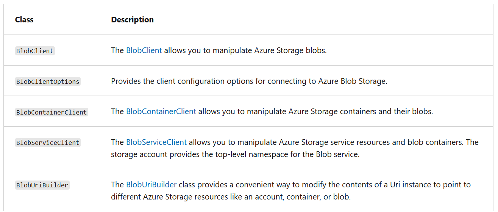

- Containers and blobs also support certain standard HTTP properties.
- Properties and metadata are both represented as standard HTTP headers;the difference between them is in the naming of the headers.
- Metadata headers are named with the header prefix _x-ms-meta-_ and a custom name.
- Property headers use standard HTTP header names, as specified in the Header Field Definitions section 14 of the HTTP/1.1 protocol specification.
- Names are case-insensitive.

**The standard HTTP headers supported on containers include:**

- ETag
- Last-Modified

**The standard HTTP headers supported on blobs include:**

- ETag
- Last-Modified
- Content-Length
- Content-Type
- Content-MD5
- Content-Encoding
- Content-Language
- Cache-Control
- Origin
- Range

- A lifecycle management policy is a collection of rules in a JSON document.
- Each rule definition within a policy includes a filter set and an action set.

`{
  "rules": [
    {
      "name": "rule1",
      "enabled": true,
      "type": "Lifecycle",
      "definition": {...}
    },
    {
      "name": "rule2",
      "type": "Lifecycle",
      "definition": {...}
    }
  ]
}`

# rules

- An array of rule objects
- At least one rule is required in a policy.
- can define up to 100 rules in a policy
- Rule Params

  - Name | string | required | A rule name can include up to 256 alphanumeric characters. Rule name is case-sensitive. It must be unique within a policy.
  - enabled | boolean | optional | An optional boolean to allow a rule to be temporarily disabled. Default value is true.
  - type | enum | optional | current valid type is Lifecycle required
  - definition | an object that defines the lifecycle rule | each definition is made up of a filter set and action set | requried

# .NET Libraries

- Azure.Storage.Blobs: Contains the primary classes (client objects) that you can use to operate on the service, containers, and blobs.
- Azure.Storage.Blobs.Specialized: Contains classes that you can use to perform operations specific to a blob type, such as block blobs.
- Azure.Storage.Blobs.Models: All other utility classes, structures, and enumeration types.

- Block blob vs Page blob

| Feature             | **Block Blob**                 | **Page Blob**             |
| ------------------- | ------------------------------ | ------------------------- |
| Primary use         | Files, images, videos, backups | VHDs, disks, databases    |
| Read/write pattern  | **Sequential**                 | **Random access**         |
| Max size            | ~190.7 TB                      | **8 TB**                  |
| Data organization   | Blocks (up to 50,000)          | 512-byte pages            |
| Update part of blob | ❌ (re-upload block)           | ✅ (update page range)    |
| Append support      | ✅ (via Append Blob type)      | ❌                        |
| Used by Azure VMs   | ❌                             | ✅ (OS & data disks)      |
| Performance         | Optimized for throughput       | Optimized for low latency |

- Block Blob → “Big files, streaming”
- Page Blob → “Disks, random I/O”

- Can set metadata either using SDK or direct url

1. Using URL

   1. Setting metadata header on Container
      PUT https://myaccount.blob.core.windows.net/mycontainer?comp=metadata&restype=container
   2. Setting metadata header on Blob
      PUT https://myaccount.blob.core.windows.net/mycontainer/myblob?comp=metadata

   3. Retrieving properties and metadata, Container
      GET/HEAD https://myaccount.blob.core.windows.net/mycontainer?restype=metadata
   4. Retrieving properties and metadata for Blob
      GET/HEAD https://myaccount.blob.core.windows.net/mycontainer/myblob?comp=metadata

- generate SAS Token to access blob Container in . NET

`BlobSasBuilder sasBuilder = new BlobSasBuilder()
{
BlobContainerName = containerClient.Name,
Resource = "c"
};
sasBuilder.ExpiresOn = DateTimeOffset.UtcNow.AddHours(1);
sasBuilder.SetPermissions(BlobContainerSasPermissions.Read);
Uri sasUri = containerClient.GenerateSasUri(sasBuilder);`

// Resource
Specifies which resources are accessible via the shared access signature.
Specify "b" if the shared resource is a blob. This grants access to the content and metadata
of the blob. Specify "c" if the shared resource is a blob container. This grants
access to the content and metadata of any blob in the container, and to the list
of blobs in the container. Beginning in version 2018-11-09, specify "bs" if the
shared resource is a blob snapshot. This grants access to the content and metadata
of the specific snapshot, but not the corresponding root blob. Beginning in version
2019-12-12, specify "bv" if the shared resource is a blob version. This grants
access to the content and metadata of the specific version, but not the corresponding
root blob.

# Retention policy

1️⃣ Time-based Retention Policy

What it is:

- A time-based retention policy ensures that a blob cannot be deleted or modified for a specific period of time.

Key points:

- Applied per container or per blob (depending on configuration)
- Once a blob is written, it cannot be modified or deleted until the retention period expires
- Commonly used for compliance with regulations (financial, legal, healthcare)

## Example:

-Retention period = 30 days
-Blob created on Jan 1 → cannot delete/overwrite until Jan 31

Benefits:

- Protects data from accidental deletion
- Meets regulatory requirements like SEC 17a-4(f) or FINRA

Config:

- Configured in Azure portal, PowerShell, or ARM templates

2️⃣ Container-level WORM Policy (Write Once, Read Many)

What it is:

- WORM = Write Once, Read Many
- Once set at the container level, all blobs in the container are immutable until policy removal or expiration

Key points:

- Can enforce legal hold or time-based retention
- Prevents overwrite and deletion of any blob within the container
- Often combined with time-based retention

Example:

- Legal requirement: All audit logs must be retained for 7 years
- Apply container-level WORM policy → all blobs written are protected for 7 years

Benefits:

- Ensures full compliance across a container
- Simplifies management of retention policies

Config:

- Can enable WORM on a container with immutable storage policies

| Feature       | Time-based Retention               | Container-level WORM                               |
| ------------- | ---------------------------------- | -------------------------------------------------- |
| Scope         | Blob or container                  | Entire container                                   |
| Duration      | Defined period                     | Until policy removal or expiration                 |
| Purpose       | Protect individual blobs           | Enforce compliance for all blobs                   |
| Compliance    | Regulatory retention               | Regulatory or legal hold                           |
| Modifications | Cannot delete/modify during period | Cannot delete/modify any blob until policy expires |

## Pricing Tiers

1. Standard - general purpose V2
2. Premium -
   1. High performance
   2. using SSD
   3. Available 3 account types
      1. Page Blob
      2. Block blob
      3. file shares
   4. No noisy-neighbor problems
   5. Ultra-low latency
   6. Predictable throughput

### Standard General Purpose V2

- Supported Blob Storage including Data Lake, Queue Storage, Table Storage & Azure Files
- Support Redundancy, LRS, ZRS, RA-GRS, GRS, GZRS, RA-GZRS
- Usage:
  - Standard storage account type for blobs, file shares, queues, and tables.
  - Recommended for most scenarios using Azure Storage.
  - _If you want support for network file system (NFS) in Azure Files, use the premium file shares account type._

### Premium Storage

1. Premium block blobs

   - Supports Blob storage, Data Lake
   - LRS & ZRS
   - Usage:
     - Premium storage account type for block blobs and _append blobs._
     - Recommended for scenarios with high transaction rates or that use smaller objects or require consistently low storage latency.

2. Premium Page Blob

   1. Page Blobs only
   2. LRS & ZRS
   3. Premium storage account type for page blobs only.
   4. Usage: Virtual Hard Disks (VHD), rand read/ write data
   5. Premium Page Blobs are basically “cloud SSD hard drives” used to store VM disks and ultra-fast databases.

| Use Case                 | Why Premium Page Blob          |
| ------------------------ | ------------------------------ |
| Azure VM OS Disk         | Fast boot & I/O                |
| Azure VM Data Disk       | Databases, high IOPS workloads |
| SQL Server on Azure VM   | Stable 5,000+ IOPS             |
| SAP HANA on Azure VM     | Guaranteed throughput          |
| Large caching engines    | Very fast random updates       |
| Legacy VHD-based systems | Needs block-level disk access  |

3. Premium File Share
   1. Azure Files
   2. LRS & ZRS
   3. Usage:
      1. Premium storage account type for file shares only.
      2. Recommended for enterprise or high-performance scale applications.

| Blob Type     | Used For                                         |
| ------------- | ------------------------------------------------ |
| Block Blob    | Normal files, images, videos, backups            |
| Append Blob   | Logs                                             |
| **Page Blob** | Virtual hard disks (VHD), random read/write data |

- Performance Comparison

| Metric     | Hot Block Blob | Premium Page Blob |
| ---------- | -------------- | ----------------- |
| Latency    | 10–30 ms       | **<1 ms**         |
| IOPS       | ~500           | **5,000+**        |
| Throughput | ~60 MB/s       | **200+ MB/s**     |

## Encryption

- By default data store in a storage are encrypted by Microsoft Managed Keys.
- To manage excryption with own keys [Service Side Encryption],
  - customer-managed key - to use for encrypting and decrypting data in Blob Storage and in Azure Files.
    - Customer-managed keys must be stored in Azure Key Vault or Azure Key Vault Managed Hardware Security Model (HSM).
    - customer-provided key:
      - on Blob Storage operations.
      - A client can include an encryption key on a read/write request for granular control over how blob data is encrypted and decrypted.
      - In order to use customer-managed keys, the following resources will need to have been created beforehand.
        - A user-assigned identity that has Get, Wrap key, and Unwrap key permissions on the same key vault.
  - Client-side encryption
    - The Blob Storage and Queue Storage client libraries uses AES in order to encrypt user data.
    - There are two versions of client-side encryption available in the client libraries:
      - Version 2 uses _Galois/Counter Mode (GCM) mode with AES_.
        - The Blob Storage and Queue Storage SDKs support client-side encryption with v2.
      - Version 1 uses Cipher Block Chaining (CBC) mode with AES.
        - _The Blob Storage, Queue Storage, and Table Storage_ SDKs support client-side encryption with v1.

## Lifecycle Policy

- Is a collection of rules in a JSON document.
- Each rule includes filter set and action set.
- The action set applies to the tier or delete actions to the filtered set of objects.
- Can define up to 100 rules in a policy.
- Applicable Filters:
  - blobTypes
    - Required
    - ex> block blob, page blob etc.
  - prefixMatch
    - Optional
    - An array of string for prefixes to be match.
    - Each rule can define up to 10 prefixes.
    - A prefix string must start with a container name
  - blobIndexMatch
    - An array of dictionary values consisting of blob index tag key and value conditions to be matched.
  - Actions
    1. tierToCool
       - Supported for block blob.
       - Supported for Snapshot
       - Supported for Previous Versions
    2. tierToCold
       - Supported for block blob
       - Supported for Snapshot
       - Supported for Previous Versions
    3. enableAutoTierToHotFromCool
       - Supported for block blob
       - Snapshot not supported
       - Previous Versions not supported
    4. tierToArchive
       - Supported for block blob
       - Supported Snapshot
       - Supported Previous Versions
    5. delete
       - supported for block blob & append blob
       - Supported for Snapshot
       - Supported for Previous Version
  - Action Run Conditions
    1. daysAfterModificationGreaterThan
       - integer value indicating the age in days
       - condition for base blob actions
    2. daysAfterCreationGreaterThan
       - integer value indicating the age in days
       - condition for blob snapshot actions
    3. daysAfterLastAccessTimeGreaterThan
       - integer value indicating the age in days
       - The condition for a current version of a blob when access tracking is enabled
    4. daysAfterLastTierChangeGreaterThan
       - Integer value indicating the age in days after last blob tier change time
       - The minimum duration in days that a rehydrated blob is kept in hot, cool, or cold tiers before being returned to the archive tier. This condition applies only to `tierToArchive` actions.

`Note: If you define more than one action on the same blob, lifecycle management applies the least expensive action to the blob. For example, action delete is cheaper than action tierToArchive. Action tierToArchive is cheaper than action tierToCool.`

### Base blobs use the last modified time to track age. Blob snapshots use the snapshot creation time to track age.

#### A lifecycle management policy must be read or written in full. Partial updates aren't supported.

### Rehydrate Blob

- Blob is in Archive tier means it is offline, hence, cannot be read or modified.
- If need to read it again, it needs to be rehydrated to an online tier either to HOT or COOL ||
- 2 options to rehydrate

  1. Copy an archived blob to an online tie: do this using `Copy Blob` or `Copy Blob from URL` operation

  - When you copy an archived blob to a new blob in an online tier, the source blob remains unmodified in the archive tier.
  - You must copy the archived blob to a new blob with a different name or to a different container.
  - You can't overwrite the source blob by copying to the same blob.

  2. Change a blob's access tier to an online tier: change the tier using `Set Blob Tier` operation.

- To set the rehydrate priority can set the header `x-ms-rehydrate-priority`

  - Options
    - Standard Priority: rehydration request is processed in the order it was recieved and might take it up to 15 hours.
    - High Priority: rehydration request is prioritized over standard priority requests and might complete in under one hour for objects under 10 GB in size.

Note: Changing a blob's tier doesn't affect its last modified time. If there is a lifecycle management policy in effect for the storage account, then rehydrating a blob with Set Blob Tier can result in a scenario where the lifecycle policy moves the blob back to the archive tier after rehydration because the last modified time is beyond the threshold set for the policy

Qn: What will happen if delete blob before minimum retain period from a tier?

- Blob containers, by default, do not permit anonymous access to their content.
- When storage account key access is disabled, any requests to the account that are authorized with Shared Key, including shared access signatures (SAS), will be denied. Client applications that currently access the storage account using shared key will no longer work.
- Hierarchical namespace, complemented by Data Lake Storage Gen2 endpoint, enables file and directory semantics, accelerates big data analytics workloads, and enables access control lists (ACLs)

  - SFTP can only be enabled for hierarchical namespace accounts
  - To enable NFS v3 'hierarchical namespace' must be enabled.

- What is Microsoft Entra Tenant?

### Protect Blob Data

#### Recovery Methods

- To Protect data from accidental or erroneous deletion or modification.
  - point-in-time restore
  - Soft-delete for blobs
  - Soft-delete for containers
  - Soft-delete for file share
  -

#### Tracking

- Manage versions and keep track of changes made to your blob data
  - Versioning
  - Blob Change feed

#### Access Control

- version-level immutability support:
  - Allows you to set time-based retention policy on the account-level that will apply to all blob versions.
  - Enable this feature to set a default policy at the account level.
  - Without enabling this, you can still set a default policy at the container level or set policies for specific blob versions.
  - Versioning is required for this property to be enabled.

| Feature                   | Protects Against             | Level            |
| ------------------------- | ---------------------------- | ---------------- |
| **Snapshot**              | Accidental overwrite/delete  | Blob             |
| **Versioning**            | Logical file history         | Blob             |
| **Soft Delete**           | Accidental deletion          | Blob / Container |
| **Point-in-Time Restore** | Mass corruption / ransomware | Account          |
| **Change Feed**           | Auditing & replication       | Account          |
| **Immutable (WORM)**      | Legal retention              | Blob             |

1. Blob Snapshot

- Creates a read-only copy of a blob at a moment in time.

  - Manual
  - Read-only
  - stored as delta
  - you manage clean up

- Use when:

  - Before modifying a critical file
  - Manual rollback

- Restore: Copy snapshot ➜ base blob

2. Blob Versioning (Auto History)

- Azure automatically keeps every previous version of every blob.
  - Automatic
  - Writable new version
  - Each update creates a new version
  - pay only for the delta storage

3. Soft Delete

- Allows restoring deleted blobs.

  - Time-based retention
  - Blob or Container level
  - Deleted data is hidden but recoverable

- Use when:
  - Human mistakes
  - App bugs deleting data

4. Point-in-Time Restore (PITR)

- This is enterprise-grade ransomware recovery.

  - Restore entire storage account
  - Choose any time within last 1–365 days
  - Restores all containers/blobs to that time

- Uses internally
  ✔ Versioning
  ✔ Change feed
  ✔ Soft delete

- Use when:
  - Ransomware encrypts everything
  - Mass accidental delete
  - Corruption at scale

This is the “NUCLEAR ROLLBACK BUTTON”.

5. Change Feed

- Immutable log of every change that happened in your storage account.

  - Blob created
  - Modified
  - Deleted
  - Snapshots
  - Versions

- Use when:
  - Auditing
  - Replication
  - SIEM monitoring
  - Data lake pipelines

#### Summary

- Change Feed tracks all operations
- Versioning stores old versions
- Soft Delete stores deleted blobs
- PITR uses Change Feed + Versioning to rebuild account

#### What should you enable in Production

| Feature     | Enable?  |
| ----------- | -------- |
| Versioning  | ✅ MUST  |
| Soft Delete | ✅ MUST  |
| Change Feed | ✅ MUST  |
| PITR        | ✅ MUST  |
| Snapshot    | Optional |

#### Real world ex:

| Accident               | Recovery    |
| ---------------------- | ----------- |
| Overwrite one file     | Versioning  |
| Delete folder          | Soft Delete |
| Ransomware attack      | PITR        |
| Audit who deleted what | Change Feed |
