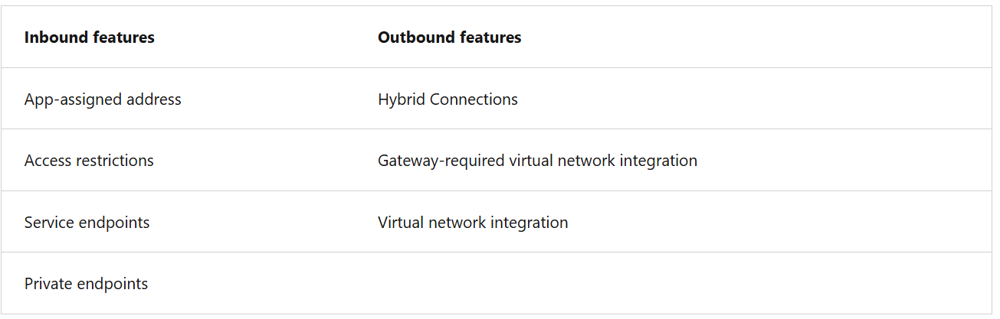
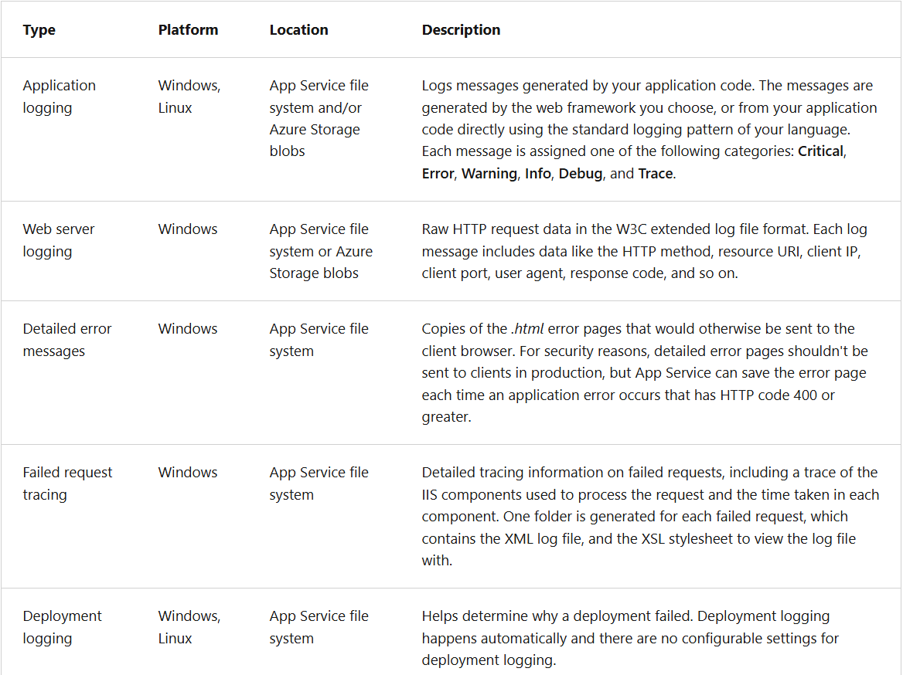
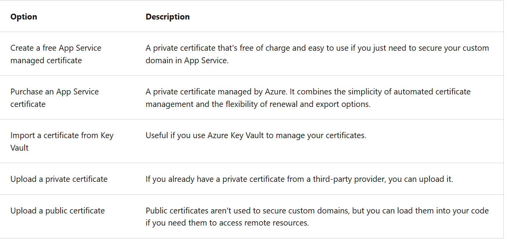
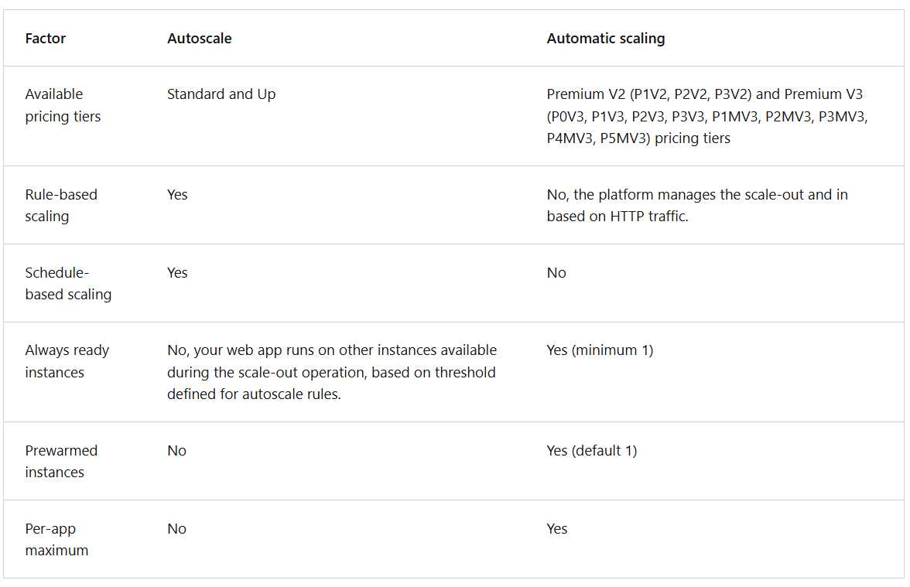
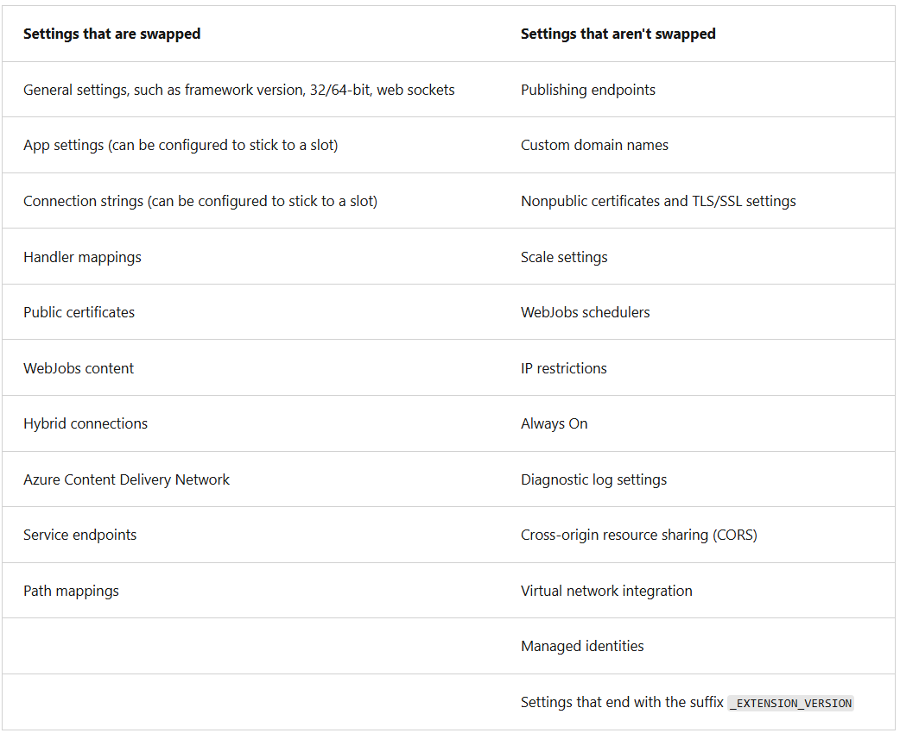

Single-tenant → App is used by users from one Entra ID tenant only
Multi-tenant → App can be used by users from multiple Entra ID tenants

Multi Tenant App Service Networking Features

- When you change the virtual machine family, you get a different set of outbound addresses.
  The worker virtual machines are broken down in large part by the App Service plans.

- Azure VM outbound address = the public IP seen by external services when the VM initiates outbound traffic.

To find the list of outbound addresses, outbound IP addresses currently used by your app | CLI Command
`az webapp show \
    --resource-group <group_name> \
    --name <app_name> \ 
    --query outboundIpAddresses \
    --output tsv`

- To find all possible outbound IP addresses for your app, regardless of pricing tiers

`az webapp show \
    --resource-group <group_name> \ 
    --name <app_name> \ 
    --query possibleOutboundIpAddresses \
    --output tsv`

- AppService Plan vs Pricing Tier

App Service Plan → The infrastructure you reserve
Pricing Tier → The size & features of that infrastructure
-->
App Service Plan → The gym membership
Pricing Tier → The membership level (basic, premium, VIP)

- App Service Plan
  What it is

  # An App Service Plan defines:

        - Region
        - OS (Windows / Linux)
        - Compute resources shared by apps:
        - CPU
        - Memory
        - Disk
        Think of it as the container (server farm) that hosts your apps.

  Key points

  - Multiple apps can run on one plan
  - All apps share the same resources
  - Billing is tied to the plan, not the app

Pricing Tier

What it is

A Pricing Tier is a setting of an App Service Plan that defines:

    - VM size (CPU / RAM)
    - Scaling limits
    - Features available

    Examples:

    - Free (F1)
    - Basic (B1–B3)
    - Standard (S1–S3)
    - Premium (P1v3–P3v3)
    - Isolated (I1–I3)

[Important] - Every App Service Plan has exactly one Pricing Tier

To Note -

- Billing is per App Service Plan
- Scaling affects all apps in the plan
- To isolate performance → use separate plans
- To change size/features → change pricing tier

_To Note_
In a default Linux app service or a custom Linux container, any nested JSON key structure in the app setting name like ApplicationInsights:InstrumentationKey needs to be configured in App Service as ApplicationInsights**InstrumentationKey for the key name. In other words, replace any : with ** (double underscore). Any periods in the app setting name are replaced with a \_ (single underscore).

- At runtime, connection strings are available as environment variables, prefixed with the following connection types:

- SQLServer: SQLCONNSTR\*
- MySQL: MYSQLCONNSTR\*
- SQLAzure: SQLAZURECONNSTR\*
- Custom: CUSTOMCONNSTR\*
- PostgreSQL: POSTGRESQLCONNSTR\*
- Notification Hub: NOTIFICATIONHUBCONNSTR\*
- Service Bus: SERVICEBUSCONNSTR\*
- Event Hub: EVENTHUBCONNSTR\*
- Document DB: DOCDBCONNSTR\*
- Redis Cache: REDISCACHECONNSTR\*

  For example, a MySQL connection string named connectionstring1 can be accessed as the environment variable MYSQLCONNSTR_connectionString1.

- Set AppSetting for Container Environment
  CLI Command
  `az webapp config appsettings set --resource-group <group-name> --name <app-name> --settings key1=value1 key2=value2`

When your app runs, the App Service app settings are injected into the process as environment variables automatically. You can verify container environment variables with the URL `https://<app-name>.scm.azurewebsites.net/Env`.

Note - Most modern browsers support HTTP/2 protocol over TLS only, while nonencrypted traffic continues to use HTTP/1.1. To ensure that client browsers connect to your app with HTTP/2, secure your custom DNS name.

**Path Mapping**

- In Azure App Service, Path Mapping tells Azure which physical directory on the App Service file system should serve a specific URL path.
- You can configure virtual applications and directories by specifying each virtual directory and its corresponding physical path relative to the website root (D:\home).
- To mark a virtual directory as a web application, clear the Directory check box.

Steps to Add Custom Storage for a Containerized App

1. Select --> New Azure Storage Mount
2. Name: The display name
3. Configuration options - Basic or Advanced. Select Basic if the storage account isn't using [service endpoints, private endpoint or azure key vault], else Advanced
4. storage accounts - the storage account with the container you want
5. Storage type: Azure Blobs or Azure Files.
   1. Windows container apps only support Azure Files.
   2. Azure Blobs only supports read-only access.
6. Storage container: For basic configuration, the container you want.
7. Share name: For advanced configuration, the file share name.
8. Access key: For advanced configuration, the access key.
9. Mount path: The absolute path in your container to mount the custom storage.
10. Deployment slot setting: When checked, the storage mount settings also apply to deployment slots.

**AppService Logging**

Main Log Types

- Application Logs
- Web Server Logs
- Detailed Error Logs
- Failed Request Logs
- Deployment Logs

For Windows Platform, Application Logs can be stored in either blob or azure file system. The Filesystem option is for temporary debugging purposes, and turns itself off in 12 hours.

For Linux/Container Web App, to store Application Logs

- Only option is File System
- Set Quota (MB) & Retention Period (days)

- ASP.NET applications can use the `System.Diagnostics.Trace` class to log information to the application diagnostics log.
- By default, ASP.NET Core uses the `Microsoft.Extensions.Logging.AzureAppServices` logging provider.

**Stream Logs**

- Before you stream logs in real time, enable the log type that you want. Any information written to files ending in .txt, .log, or .htm that are stored in the `/LogFiles` directory `(d:/home/logfiles)` is streamed by App Service.

For logs stored in the App Service file system, the easiest way is to download the ZIP file in the browser at:

- Linux/container apps: `https://<app-name>.scm.azurewebsites.net/api/logs/docker/zip`
- Windows apps: `https://<app-name>.scm.azurewebsites.net/api/dump`

[Important]
For Linux/container apps, the ZIP file contains console output logs for both the docker host and the docker container.
For a scaled-out app, the ZIP file contains one set of logs for each instance. In the App Service file system, these log files are the contents of the /home/LogFiles directory.

- A certificate uploaded into an app is stored in a deployment unit that is bound to the app service plan's resource group and region combination (internally called a **webspace**).
- The certificate is accessible to other apps in the same resource group and region combination.

- options you have for adding certificates in App Service

[Important] - Public certificates aren't used to secure custom domains

- To use private certificate in app service, it must meet the following requirements

  - Exported as a password-protected PFX file, encrypted using triple DES.
  - Contains private key at least 2,048 bits long.
  - Contains all intermediate certificates and the root certificate in the certificate chain.

- To secure a custom domain in a TLS binding, the certificate has other requirements:
  - Contains an Extended Key Usage for server authentication (OID = 1.3.6.1.5.5.7.3.1)
  - Signed by a trusted certificate authority

[Important]

- To create custom TLS/SSL bindings or enable client certificates for your App Service app, your App Service plan must be in the Basic, Standard, Premium, or Isolated tier.
- The free App Service managed certificate is a turn-key solution for securing your custom DNS name in App Service. It's a TLS/SSL server certificate fully managed by App Service and renewed continuously and automatically in six-month increments, 45 days before expiration.

- The free certificate comes with the following limitations:

  - Doesn't support wildcard certificates.
  - Doesn't support usage as a client certificate by using certificate thumbprint, which is planned for deprecation and removal.
  - Doesn't support private DNS.
  - Isn't exportable.
  - Isn't supported in an App Service Environment (ASE).
  - Only supports alphanumeric characters, dashes (-), and periods (.).
  - Only custom domains of length up to 64 characters are supported.

[Important]

- App Service Certificates aren't supported in Azure National Clouds at this time.

- Azure Web Apps Automatic Scaling, 2 Options
  1. Auto scale - Scaling done by defined rules
  2. Automatic Scale - Scaling done by defined parameters

- Autoscaling is doing scale in/out instead scale up/down.

  - Autoscaling responds to changes in the environment by adding or removing web servers and balancing the load between them.
  - Autoscaling doesn't have any effect on the CPU power, memory, or storage capacity of the web servers powering the app, it only changes the number of web servers.
  - 2 Options for Autoscaling
    - based on metric
    - scale to specific instance count according to a schedule
  - [ If you need to scale out incrementally, you can combine metric and schedule-based autoscaling in the same autoscale condition. ]
  - An App Service Plan also has a default condition that is used if none of the other conditions are applicable. This condition is always active and doesn't have a schedule.

- Metrics for autoscale rules for a web app

  - CPU Percentage - cpu usage accross all instances.
  - Memory Percentage - This metric captures the memory occupancy of the application across all instances.
  - Disk queue length - This metric is a measure of the number of outstanding I/O requests across all instances.
  - Http Queue Length - This metric shows how many client requests are waiting for processing by the web app. If this no is large will throw 408 http error
  - Data In - the number of bytes received across all instances.
  - Data Out - the number of bytes sent by all instances.

- An autoscale action has a cool down period, specified in minutes. During this interval, the scale rule can't be triggered again. The minimum cool down period is five minutes.
- A single autoscale condition can contain several autoscale rules
- For Autoscaling can have multiple set of rules for scale in/out. [!Important]

  - Scale out will be done if either one of the scale out conditions true
  - Scale in will be done when all the scale in conditions are true

- [Not all pricing tiers support autoscaling. The development pricing tiers are either limited to a single instance (the F1 and D1 tiers), or they only provide manual scaling (the B1 tier). If you selected one of these tiers, you must first scale up to the S1 or any of the P level production tiers.]

- Automatic Scaling [scaling by defined parameters]
  - When to use Automatic Scaling
    - You don't want to set up autoscale rules based on resource metrics.
    - You want your web apps within the same App Service Plan to scale differently and independently of each other.
    - Your web app is connected to a database or legacy system, which may not scale as fast as the web app. Scaling automatically allows you to set the maximum number of instances your App Service Plan can scale to. This setting helps the web app to not overwhelm the backend.

**Slots**

- Slots are available Pricing Tiers Standard, Premium, Isolated.
- The slot's URL has the format `http://sitename-slotname.azurewebsites.net`.

- Note | To make settings swappable, add the app setting _WEBSITE_OVERRIDE_PRESERVE_DEFAULT_STICKY_SLOT_SETTINGS_ in every slot of the app and set its value to 0 or false. These settings are either all swappable or not at all. You can't make just some settings swappable and not the others. Managed identities are never swapped and aren't affected by this override app setting.

- To configure an app setting or connection string to stick to a specific slot (not swapped), go to the Configuration page for that slot. Add or edit a setting, and then select Deployment slot setting. Selecting this check box tells App Service that the setting isn't swappable.

- Auto swap isn't currently supported in web apps on Linux and Web App for Containers.
- pre warmup or custom initialization,

`<system.webServer>
    <applicationInitialization>
        <add initializationPage="/" hostName="[app hostname]" />
        <add initializationPage="/Home/About" hostName="[app hostname]" />
    </applicationInitialization>
</system.webServer>`

- App Settings can be used to warm-up

  1. WEBSITE_SWAP_WARMUP_PING_PATH: The path to ping to warm up your site. Add this app setting by specifying a custom path that begins with a slash as the value. An example is /statuscheck. The default value is /.
  2. WEBSITE_SWAP_WARMUP_PING_STATUSES: Valid HTTP response codes for the warm-up operation. Add this app setting with a comma-separated list of HTTP codes. An example is 200,202 . If the returned status code isn't in the list, the warmup and swap operations are stopped. By default, all response codes are valid.
  3. WEBSITE_WARMUP_PATH: A relative path on the site that should be pinged whenever the site restarts (not only during slot swaps). Example values include /statuscheck or the root path, /.

- By setting route traffic % can divert route traffice among the slots.
- After a client is automatically routed to a specific slot, it's "pinned" to that slot for the life of that client session. On the client browser, you can see which slot your session is pinned to by looking at the x-ms-routing-name cookie in your HTTP headers. A request routed to the "staging" slot has the cookie `x-ms-routing-name=staging`. A request routed to the production slot has the cookie `x-ms-routing-name=self`.
- Rather doing automatic traffic manage, can do manual routing among slots using the query params.
  - ex. `.azurewebsites.net/?x-ms-routing-name=staging`

# App Service on Linux | Limitation

1. Azure portal shows only the features support for Linux
2. Not supported for Shared pricing tier
3. When deployed to built-in images, your code and content are allocated as a storage volume for web content, backed by Azure Storage.
   1. The disk latency of this volume is higher and more variable than the latency of the container filesystem.
   2. Apps that require heavy read-only access to content files might benefit from the custom container option, which places files in the container filesystem instead of on the content volume. [Important]
   - This can be a question, as in what is the App Service type should be to deploy heavy readonly application?

- Azure App Service zone redundancy is supported only on Premium v2 and Premium v3 plans.
- Slots are available only in Standard or Premium Plans
